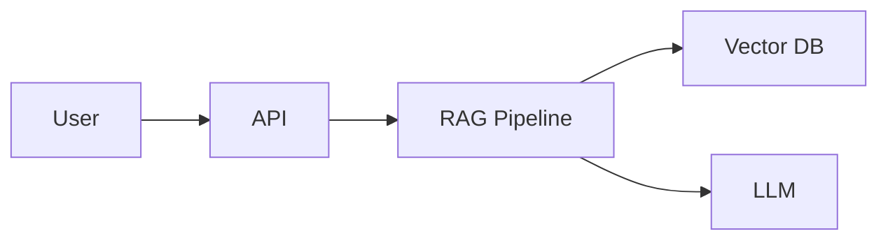

# 🚀 LỘ TRÌNH 90 NGÀY TRỞ THÀNH AI ENGINEER

## Chuyên sâu: Ứng dụng AI trong lĩnh vực Môi trường

---

## 📋 MỤC LỤC

1. [Tổng quan lộ trình](#tổng-quan-lộ-trình)
2. [Yêu cầu tiên quyết](#yêu-cầu-tiên-quyết)
3. [Giai đoạn 1: Nền tảng (Tuần 1-4)](#giai-đoạn-1-nền-tảng-tuần-1-4)
4. [Giai đoạn 2: Trung cấp (Tuần 5-8)](#giai-đoạn-2-trung-cấp-tuần-5-8)
5. [Giai đoạn 3: Nâng cao (Tuần 9-12)](#giai-đoạn-3-nâng-cao-tuần-9-12)
6. [Tổng quan 5 dự án Portfolio](#tổng-quan-5-dự-án-portfolio)
7. [Tài nguyên học tập](#tài-nguyên-học-tập)
8. [Đánh giá và chứng nhận](#đánh-giá-và-chứng-nhận)

---

## TỔNG QUAN LỘ TRÌNH

### Mục tiêu

Sau 90 ngày, bạn sẽ có khả năng:

- Xây dựng các hệ thống AI end-to-end từ prototype đến production
- Thiết kế và triển khai RAG systems, semantic search, multi-agent architectures
- Phát triển ứng dụng AI chuyên biệt cho domain môi trường
- Tự tin apply vị trí AI Engineer với portfolio 5 dự án hoàn chỉnh

### Cấu trúc thời gian

| Giai đoạn | Tuần | Trọng tâm | Output |
|-----------|------|-----------|--------|
| Foundation | 1-4 | Python, ML/NLP cơ bản, Vector DB | Project 1-2 |
| Intermediate | 5-8 | RAG, LLM, Prompt Engineering | Project 3 |
| Advanced | 9-12 | Multi-Agent, Production, Domain-specific | Project 4-5 |

### Thời gian học tập khuyến nghị

- **Ngày thường**: 2-3 giờ/ngày
- **Cuối tuần**: 4-6 giờ/ngày
- **Tổng cộng**: ~250-300 giờ học tập

---

## YÊU CẦU TIÊN QUYẾT

### Kiến thức nền tảng

| Lĩnh vực | Mức độ yêu cầu | Chi tiết |
|----------|----------------|----------|
| Python | Trung bình | OOP, functions, modules, virtual environments |
| Git/GitHub | Cơ bản | Clone, commit, push, pull, branching |
| Terminal/CLI | Cơ bản | Navigation, file operations, package management |
| English | Đọc hiểu | Đọc documentation và research papers |

### Công cụ cần chuẩn bị

```bash
# Development Environment
- Python 3.10+
- VS Code / PyCharm
- Git
- Docker Desktop

# API Keys (chuẩn bị sẵn)
- OpenAI API Key
- Anthropic API Key (optional)
- Hugging Face Token
```

### Cấu hình máy tính khuyến nghị

- **RAM**: Tối thiểu 16GB (khuyến nghị 32GB)
- **Storage**: SSD 256GB+ trống
- **GPU**: Optional, có thể sử dụng Google Colab/cloud services

---

## GIAI ĐOẠN 1: NỀN TẢNG (Tuần 1-4)

### 📅 TUẦN 1: Python cho AI Engineering & Xử lý dữ liệu

#### Mục tiêu học tập

- [ ] Thành thạo Python data structures và algorithms cần thiết cho AI
- [ ] Sử dụng thành thạo NumPy, Pandas cho data manipulation
- [ ] Hiểu và áp dụng data preprocessing techniques
- [ ] Làm quen với environmental data formats

#### Kiến thức cốt lõi

**1. Python Advanced Concepts**

```python
# Type hints - Essential for production code
from typing import List, Dict, Optional, Union, Callable
from dataclasses import dataclass
from abc import ABC, abstractmethod

@dataclass
class EnvironmentalSample:
    """Cấu trúc dữ liệu mẫu môi trường"""
    sample_id: str
    location: str
    parameters: Dict[str, float]
    timestamp: str
    
# Context managers
class DataProcessor:
    def __enter__(self):
        # Initialize resources
        return self
    
    def __exit__(self, exc_type, exc_val, exc_tb):
        # Cleanup resources
        pass

# Generators for memory-efficient data processing
def stream_environmental_data(file_path: str):
    """Generator để xử lý file lớn theo chunks"""
    with open(file_path, 'r') as f:
        for line in f:
            yield process_line(line)
```

**2. Data Processing với Pandas**

```python
import pandas as pd
import numpy as np

# Environmental data preprocessing pipeline
class EnvironmentalDataPipeline:
    def __init__(self, data_path: str):
        self.df = pd.read_csv(data_path)
    
    def clean_data(self) -> pd.DataFrame:
        """Làm sạch dữ liệu môi trường"""
        # Handle missing values
        self.df = self.df.fillna(method='ffill')
        
        # Remove outliers using IQR
        for col in self.df.select_dtypes(include=[np.number]).columns:
            Q1, Q3 = self.df[col].quantile([0.25, 0.75])
            IQR = Q3 - Q1
            self.df = self.df[
                (self.df[col] >= Q1 - 1.5*IQR) & 
                (self.df[col] <= Q3 + 1.5*IQR)
            ]
        return self.df
    
    def normalize_parameters(self) -> pd.DataFrame:
        """Chuẩn hóa các thông số theo QCVN"""
        # Áp dụng tiêu chuẩn Việt Nam
        pass
```

**3. File I/O và Data Formats**

| Format | Use Case | Library |
|--------|----------|---------|
| CSV | Tabular environmental data | pandas |
| JSON | API responses, configs | json, orjson |
| PDF | Regulatory documents | PyPDF2, pdfplumber |
| DOCX | Reports, EIA documents | python-docx |
| Parquet | Large-scale data storage | pyarrow |

#### Ứng dụng Environmental Domain

**Bài tập thực hành: Xử lý dữ liệu quan trắc môi trường**

```python
"""
Bài tập: Xây dựng pipeline xử lý dữ liệu quan trắc không khí
- Input: CSV data từ trạm quan trắc (PM2.5, PM10, CO, NO2, SO2, O3)
- Output: Clean dataset với các thông số đã chuẩn hóa theo QCVN 05:2023
"""

# QCVN 05:2023/BTNMT - Giới hạn các thông số
QCVN_05_2023 = {
    'PM2.5': {'1h': None, '24h': 50, 'year': 25},  # μg/m³
    'PM10': {'1h': None, '24h': 100, 'year': 50},
    'CO': {'1h': 30000, '8h': 10000, '24h': None},  # μg/m³
    'NO2': {'1h': 200, '24h': 100, 'year': 40},
    'SO2': {'1h': 350, '24h': 125, 'year': 50},
    'O3': {'1h': 180, '8h': 120, '24h': None}
}

def calculate_aqi_vietnam(pollutant: str, concentration: float) -> int:
    """Tính chỉ số AQI theo phương pháp Việt Nam"""
    # Implementation based on QCVN
    pass
```

#### Tài nguyên tuần 1

| Loại | Tài nguyên | Link/Nguồn |
|------|------------|------------|
| Course | Python for Data Science | DataCamp, Coursera |
| Documentation | Pandas User Guide | pandas.pydata.org |
| Practice | LeetCode Python | leetcode.com |
| Domain | QCVN về môi trường | monre.gov.vn |

#### Deliverable tuần 1

- [ ] Script xử lý dữ liệu quan trắc môi trường
- [ ] Notebook EDA (Exploratory Data Analysis) cho environmental dataset
- [ ] Unit tests cho data processing functions

---

### 📅 TUẦN 2: Machine Learning Fundamentals & NLP Basics

#### Mục tiêu học tập

- [ ] Nắm vững ML workflow: data → train → evaluate → deploy
- [ ] Hiểu các thuật toán ML cơ bản và use cases
- [ ] Làm quen với NLP pipeline và text preprocessing
- [ ] Áp dụng ML/NLP cho environmental text data

#### Kiến thức cốt lõi

**1. Machine Learning Fundamentals**

```
ML Workflow Overview:
┌─────────────┐    ┌─────────────┐    ┌─────────────┐    ┌─────────────┐
│   Data      │───▶│  Feature    │───▶│   Model     │───▶│  Evaluation │
│ Collection  │    │ Engineering │    │  Training   │    │  & Tuning   │
└─────────────┘    └─────────────┘    └─────────────┘    └─────────────┘
                                                                │
                          ┌─────────────┐                       │
                          │ Deployment  │◀──────────────────────┘
                          └─────────────┘
```

**2. Các thuật toán ML cần nắm**

| Thuật toán | Loại | Use Case trong Environmental |
|------------|------|------------------------------|
| Linear/Logistic Regression | Supervised | Dự đoán chất lượng nước, phân loại mức ô nhiễm |
| Decision Trees/Random Forest | Supervised | Phân loại nguồn ô nhiễm, risk assessment |
| K-Means/DBSCAN | Unsupervised | Clustering khu vực ô nhiễm, pattern detection |
| SVM | Supervised | Text classification cho regulatory documents |
| XGBoost/LightGBM | Ensemble | Dự đoán AQI, environmental forecasting |

**3. NLP Pipeline cơ bản**

```python
import spacy
from sklearn.feature_extraction.text import TfidfVectorizer

# NLP Pipeline cho văn bản pháp luật môi trường
class EnvironmentalNLPPipeline:
    def __init__(self):
        self.nlp = spacy.load("vi_core_news_lg")
        self.vectorizer = TfidfVectorizer(
            max_features=10000,
            ngram_range=(1, 3)
        )
    
    def preprocess(self, text: str) -> str:
        """Tiền xử lý văn bản tiếng Việt"""
        doc = self.nlp(text)
        
        # Tokenization + Lemmatization + Stop word removal
        tokens = [
            token.lemma_.lower() 
            for token in doc 
            if not token.is_stop and not token.is_punct
        ]
        
        return " ".join(tokens)
    
    def extract_entities(self, text: str) -> Dict[str, List[str]]:
        """Trích xuất entities từ văn bản quy định"""
        doc = self.nlp(text)
        
        entities = {
            'regulations': [],      # Số hiệu văn bản
            'organizations': [],    # Tổ chức
            'parameters': [],       # Thông số môi trường
            'locations': [],        # Địa điểm
            'dates': []            # Thời gian
        }
        
        for ent in doc.ents:
            if ent.label_ == 'LAW':
                entities['regulations'].append(ent.text)
            elif ent.label_ == 'ORG':
                entities['organizations'].append(ent.text)
            # ... more entity types
        
        return entities
```

**4. Text Classification cho Environmental Documents**

```python
from sklearn.model_selection import train_test_split
from sklearn.naive_bayes import MultinomialNB
from sklearn.metrics import classification_report

class EnvironmentalDocClassifier:
    """Phân loại văn bản quy định môi trường"""
    
    CATEGORIES = [
        'air_quality',      # Chất lượng không khí
        'water_quality',    # Chất lượng nước
        'waste_management', # Quản lý chất thải
        'eia_procedure',    # Thủ tục ĐTM
        'penalty',          # Xử phạt
        'permit'            # Giấy phép
    ]
    
    def __init__(self):
        self.vectorizer = TfidfVectorizer(max_features=5000)
        self.classifier = MultinomialNB()
    
    def train(self, texts: List[str], labels: List[str]):
        X = self.vectorizer.fit_transform(texts)
        self.classifier.fit(X, labels)
    
    def predict(self, text: str) -> str:
        X = self.vectorizer.transform([text])
        return self.classifier.predict(X)[0]
```

#### Ứng dụng Environmental Domain

**Bài tập thực hành: Phân loại văn bản quy định môi trường**

```
Task: Xây dựng classifier phân loại văn bản theo:
1. Loại văn bản (Luật, Nghị định, Thông tư, QCVN, TCVN)
2. Lĩnh vực (Không khí, Nước, Đất, Chất thải, ĐTM)
3. Mức độ ưu tiên (Cao, Trung bình, Thấp)

Dataset: Crawl từ thuvienphapluat.vn, vanban.chinhphu.vn
```

#### Tài nguyên tuần 2

| Loại | Tài nguyên | Ghi chú |
|------|------------|---------|
| Course | Andrew Ng's ML Course | Coursera - foundational |
| Course | NLP Specialization | DeepLearning.AI |
| Library | scikit-learn documentation | sklearn.org |
| Library | spaCy for Vietnamese | Cài đặt vi_core_news_lg |

#### Deliverable tuần 2

- [ ] Notebook: ML models cho environmental data prediction
- [ ] Script: NLP pipeline cho Vietnamese regulatory text
- [ ] Document classifier với accuracy > 85%

---

### 📅 TUẦN 3: Vector Databases & Semantic Search

#### Mục tiêu học tập

- [ ] Hiểu embedding models và vector representations
- [ ] Thành thạo ít nhất 2 vector databases (ChromaDB, Pinecone)
- [ ] Implement semantic search system
- [ ] Xây dựng search engine cho environmental regulations

#### Kiến thức cốt lõi

**1. Embeddings và Vector Representations**

```
Text → Embedding Model → Vector (768-1536 dimensions)
                              ↓
                    Semantic Meaning Captured

Ví dụ:
"Ô nhiễm không khí" → [0.23, -0.45, 0.12, ..., 0.67]
"Air pollution"      → [0.21, -0.43, 0.14, ..., 0.65]
                              ↓
            Cosine Similarity ≈ 0.95 (semantic similar)
```

**2. Embedding Models cho Vietnamese**

| Model | Dimensions | Vietnamese Support | Use Case |
|-------|------------|-------------------|----------|
| OpenAI text-embedding-3-small | 1536 | Tốt | General purpose |
| OpenAI text-embedding-3-large | 3072 | Tốt | High accuracy needed |
| sentence-transformers/paraphrase-multilingual | 768 | Khá | Open source option |
| VinAI/PhoBERT | 768 | Rất tốt | Vietnamese-specific |
| BAAI/bge-m3 | 1024 | Tốt | Multilingual, dense+sparse |

**3. Vector Database Comparison**

```
┌─────────────────────────────────────────────────────────────────────┐
│                    Vector Database Selection Guide                   │
├─────────────┬───────────────┬───────────────┬───────────────────────┤
│   Feature   │   ChromaDB    │   Pinecone    │      Qdrant           │
├─────────────┼───────────────┼───────────────┼───────────────────────┤
│ Deployment  │ Local/Embed   │ Cloud only    │ Local/Cloud           │
│ Scale       │ < 1M vectors  │ Billions      │ Millions              │
│ Cost        │ Free          │ Pay per use   │ Free tier available   │
│ Metadata    │ Full support  │ Full support  │ Advanced filtering    │
│ Best for    │ Prototyping   │ Production    │ Self-hosted prod      │
└─────────────┴───────────────┴───────────────┴───────────────────────┘
```

**4. Implementation với ChromaDB**

```python
import chromadb
from chromadb.utils import embedding_functions

class EnvironmentalRegulationSearch:
    """Semantic search cho văn bản quy định môi trường"""
    
    def __init__(self, collection_name: str = "environmental_regulations"):
        self.client = chromadb.PersistentClient(path="./chroma_db")
        
        # Sử dụng OpenAI embeddings
        self.embedding_fn = embedding_functions.OpenAIEmbeddingFunction(
            api_key=os.getenv("OPENAI_API_KEY"),
            model_name="text-embedding-3-small"
        )
        
        self.collection = self.client.get_or_create_collection(
            name=collection_name,
            embedding_function=self.embedding_fn,
            metadata={"hnsw:space": "cosine"}
        )
    
    def add_documents(self, documents: List[Dict]):
        """
        Thêm văn bản vào database
        
        documents = [
            {
                "id": "ND08_2022",
                "text": "Nghị định 08/2022/NĐ-CP về bảo vệ môi trường...",
                "metadata": {
                    "type": "decree",
                    "year": 2022,
                    "topic": "environmental_protection",
                    "effective_date": "2022-01-10"
                }
            }
        ]
        """
        self.collection.add(
            documents=[d["text"] for d in documents],
            ids=[d["id"] for d in documents],
            metadatas=[d["metadata"] for d in documents]
        )
    
    def search(
        self, 
        query: str, 
        n_results: int = 5,
        filter_metadata: Dict = None
    ) -> List[Dict]:
        """
        Tìm kiếm semantic với metadata filtering
        
        Ví dụ:
        - query: "quy định về xả thải nước công nghiệp"
        - filter: {"topic": "water_quality", "year": {"$gte": 2020}}
        """
        results = self.collection.query(
            query_texts=[query],
            n_results=n_results,
            where=filter_metadata
        )
        
        return [
            {
                "id": results["ids"][0][i],
                "text": results["documents"][0][i],
                "metadata": results["metadatas"][0][i],
                "distance": results["distances"][0][i]
            }
            for i in range(len(results["ids"][0]))
        ]
    
    def hybrid_search(self, query: str, keyword_weight: float = 0.3):
        """Kết hợp semantic search và keyword search"""
        # Semantic results
        semantic_results = self.search(query)
        
        # Keyword search (BM25)
        keyword_results = self._keyword_search(query)
        
        # Combine with weights
        return self._merge_results(
            semantic_results, 
            keyword_results, 
            keyword_weight
        )
```

**5. Chunking Strategies**

```python
from langchain.text_splitter import RecursiveCharacterTextSplitter

class EnvironmentalDocumentChunker:
    """Chunking strategies cho văn bản pháp luật"""
    
    def __init__(self):
        # Strategy 1: Fixed size chunks
        self.fixed_splitter = RecursiveCharacterTextSplitter(
            chunk_size=1000,
            chunk_overlap=200,
            separators=["\n\n", "\n", ".", " "]
        )
        
    def chunk_by_article(self, text: str) -> List[str]:
        """
        Chunk theo Điều, Khoản, Điểm
        Phù hợp với cấu trúc văn bản pháp luật VN
        """
        import re
        
        # Pattern cho Điều
        article_pattern = r'(Điều \d+\..*?)(?=Điều \d+\.|$)'
        articles = re.findall(article_pattern, text, re.DOTALL)
        
        chunks = []
        for article in articles:
            # Nếu điều quá dài, chia tiếp theo Khoản
            if len(article) > 2000:
                clause_pattern = r'(\d+\..*?)(?=\d+\.|$)'
                clauses = re.findall(clause_pattern, article, re.DOTALL)
                chunks.extend(clauses)
            else:
                chunks.append(article)
        
        return chunks
    
    def chunk_with_context(self, text: str, doc_metadata: Dict) -> List[Dict]:
        """Chunk kèm context và metadata"""
        chunks = self.chunk_by_article(text)
        
        return [
            {
                "text": chunk,
                "metadata": {
                    **doc_metadata,
                    "chunk_index": i,
                    "total_chunks": len(chunks)
                }
            }
            for i, chunk in enumerate(chunks)
        ]
```

#### Ứng dụng Environmental Domain

**PROJECT 1: Environmental Regulation Semantic Search**

```
🎯 Mục tiêu: Xây dựng search engine cho văn bản quy định môi trường VN

📋 Features:
1. Semantic search trên 100+ văn bản (Luật, NĐ, TT, QCVN)
2. Filtering theo: năm, loại văn bản, lĩnh vực
3. Hiển thị context và citations
4. API endpoint cho integration

🛠 Tech Stack:
- ChromaDB (vector storage)
- OpenAI Embeddings
- FastAPI (API layer)
- Streamlit (Demo UI)

📊 Success Metrics:
- Search latency < 500ms
- Relevance score > 0.8 (human evaluation)
- Coverage: 100+ documents indexed
```

#### Deliverable tuần 3

- [ ] ChromaDB setup với 50+ environmental documents
- [ ] Search API với FastAPI
- [ ] Demo UI với Streamlit
- [ ] Documentation: chunking strategy analysis

---

### 📅 TUẦN 4: LLM Fundamentals & Prompt Engineering

#### Mục tiêu học tập

- [ ] Hiểu LLM architectures và capabilities
- [ ] Thành thạo prompt engineering techniques
- [ ] Implement LLM integration với OpenAI/Anthropic APIs
- [ ] Áp dụng LLM cho environmental domain tasks

#### Kiến thức cốt lõi

**1. LLM Landscape**

```
┌─────────────────────────────────────────────────────────────────────┐
│                        LLM Selection Guide                           │
├─────────────────┬───────────────┬───────────────┬───────────────────┤
│     Model       │    Strength   │   Use Case    │      Cost         │
├─────────────────┼───────────────┼───────────────┼───────────────────┤
│ GPT-4 Turbo     │ Reasoning     │ Complex tasks │ $10/1M tokens     │
│ GPT-3.5 Turbo   │ Speed/Cost    │ Simple tasks  │ $0.5/1M tokens    │
│ Claude 3 Opus   │ Analysis      │ Long docs     │ $15/1M tokens     │
│ Claude 3 Sonnet │ Balance       │ General       │ $3/1M tokens      │
│ Gemini Pro      │ Multimodal    │ Mixed content │ Free tier avail   │
│ Llama 3 70B     │ Open source   │ Self-hosted   │ Compute only      │
└─────────────────┴───────────────┴───────────────┴───────────────────┘
```

**2. Prompt Engineering Framework**

```python
class PromptTemplate:
    """Framework cho prompt engineering"""
    
    @staticmethod
    def zero_shot(task: str, context: str = "") -> str:
        """Zero-shot prompting"""
        return f"""
{context}

Task: {task}

Provide your response:
"""
    
    @staticmethod
    def few_shot(task: str, examples: List[Dict], context: str = "") -> str:
        """Few-shot prompting với examples"""
        examples_text = "\n\n".join([
            f"Input: {ex['input']}\nOutput: {ex['output']}"
            for ex in examples
        ])
        
        return f"""
{context}

Here are some examples:

{examples_text}

Now, complete this task:
Input: {task}
Output:
"""
    
    @staticmethod
    def chain_of_thought(task: str, context: str = "") -> str:
        """Chain-of-thought prompting"""
        return f"""
{context}

Task: {task}

Let's approach this step by step:
1. First, I'll analyze the key components...
2. Then, I'll consider the relevant factors...
3. Finally, I'll synthesize my conclusion...

Step-by-step reasoning:
"""
    
    @staticmethod
    def environmental_expert(task: str, regulations: str = "") -> str:
        """Prompt template cho environmental domain"""
        return f"""
You are an expert environmental consultant in Vietnam with deep knowledge of:
- Vietnamese environmental laws (Luật BVMT 2020)
- Environmental regulations (Nghị định 08/2022/NĐ-CP)
- Technical standards (QCVN, TCVN)
- EIA procedures and requirements

Relevant regulations:
{regulations}

Task: {task}

Provide a comprehensive response that:
1. Cites specific regulations where applicable
2. Uses correct Vietnamese legal terminology
3. Includes practical implementation guidance
4. Notes any recent updates or changes

Response:
"""
```

**3. Advanced Prompting Techniques**

```python
class AdvancedPrompting:
    """Kỹ thuật prompt nâng cao"""
    
    @staticmethod
    def self_consistency(task: str, n_samples: int = 3) -> str:
        """Generate multiple reasoning paths"""
        return f"""
For the following task, provide {n_samples} different approaches to reach the answer.
Then, analyze which approach is most reliable.

Task: {task}

Approach 1:
[reasoning...]

Approach 2:
[reasoning...]

Approach 3:
[reasoning...]

Final Answer (based on consensus):
"""
    
    @staticmethod
    def tree_of_thought(task: str) -> str:
        """Tree of thought prompting"""
        return f"""
Task: {task}

Let's explore multiple solution paths:

Branch A: [First approach]
  └── Sub-branch A1: [Detail]
  └── Sub-branch A2: [Detail]
  └── Evaluation: [Pros/Cons]

Branch B: [Second approach]
  └── Sub-branch B1: [Detail]
  └── Sub-branch B2: [Detail]
  └── Evaluation: [Pros/Cons]

Best Path Selection:
[Choose and justify the optimal approach]

Final Solution:
"""
    
    @staticmethod
    def react_pattern(task: str, tools: List[str]) -> str:
        """ReAct: Reasoning + Acting pattern"""
        tools_desc = "\n".join([f"- {tool}" for tool in tools])
        
        return f"""
Available Tools:
{tools_desc}

Task: {task}

Follow this pattern:
Thought: [What do I need to do?]
Action: [Which tool to use?]
Observation: [What did I learn?]
... (repeat as needed)
Final Answer: [Synthesized response]
"""
```

**4. LLM Integration**

```python
from openai import OpenAI
from anthropic import Anthropic

class LLMClient:
    """Unified LLM client với fallback"""
    
    def __init__(self):
        self.openai = OpenAI()
        self.anthropic = Anthropic()
    
    async def complete(
        self,
        prompt: str,
        model: str = "gpt-4-turbo-preview",
        temperature: float = 0.7,
        max_tokens: int = 2000,
        **kwargs
    ) -> str:
        """Generate completion với error handling"""
        
        try:
            if model.startswith("gpt"):
                response = await self.openai.chat.completions.create(
                    model=model,
                    messages=[{"role": "user", "content": prompt}],
                    temperature=temperature,
                    max_tokens=max_tokens,
                    **kwargs
                )
                return response.choices[0].message.content
            
            elif model.startswith("claude"):
                response = await self.anthropic.messages.create(
                    model=model,
                    max_tokens=max_tokens,
                    messages=[{"role": "user", "content": prompt}]
                )
                return response.content[0].text
                
        except Exception as e:
            # Fallback to alternative model
            return await self._fallback_complete(prompt, e)
    
    def stream_complete(self, prompt: str, model: str = "gpt-4"):
        """Streaming response cho real-time output"""
        stream = self.openai.chat.completions.create(
            model=model,
            messages=[{"role": "user", "content": prompt}],
            stream=True
        )
        
        for chunk in stream:
            if chunk.choices[0].delta.content:
                yield chunk.choices[0].delta.content
```

#### Ứng dụng Environmental Domain

**Bài tập: Environmental Q&A System**

```python
class EnvironmentalQA:
    """Q&A system cho quy định môi trường"""
    
    SYSTEM_PROMPT = """
    Bạn là chuyên gia tư vấn pháp luật môi trường Việt Nam.
    
    Nhiệm vụ:
    - Trả lời câu hỏi về quy định môi trường
    - Trích dẫn điều khoản cụ thể
    - Giải thích bằng ngôn ngữ dễ hiểu
    - Cảnh báo nếu quy định có thể đã thay đổi
    
    Lưu ý:
    - Luật BVMT 2020 có hiệu lực từ 01/01/2022
    - Nghị định 08/2022 quy định chi tiết
    - Luôn recommend kiểm tra văn bản gốc
    """
    
    def __init__(self, search_engine: EnvironmentalRegulationSearch):
        self.search = search_engine
        self.llm = LLMClient()
    
    async def answer(self, question: str) -> Dict:
        # 1. Retrieve relevant regulations
        relevant_docs = self.search.search(question, n_results=5)
        
        # 2. Construct prompt với context
        context = "\n\n".join([
            f"[{doc['id']}]: {doc['text'][:500]}..."
            for doc in relevant_docs
        ])
        
        prompt = f"""
{self.SYSTEM_PROMPT}

Relevant regulations:
{context}

Question: {question}

Answer (cite specific articles):
"""
        
        # 3. Generate answer
        answer = await self.llm.complete(prompt)
        
        return {
            "question": question,
            "answer": answer,
            "sources": [doc['id'] for doc in relevant_docs]
        }
```

#### Deliverable tuần 4

- [ ] Prompt template library cho environmental domain
- [ ] LLM integration module với OpenAI/Anthropic
- [ ] Q&A prototype với citation
- [ ] **PROJECT 1 hoàn thành**: Semantic Search System

---

## GIAI ĐOẠN 2: TRUNG CẤP (Tuần 5-8)

### 📅 TUẦN 5: RAG Architecture & Implementation

#### Mục tiêu học tập

- [ ] Hiểu sâu RAG (Retrieval-Augmented Generation) architecture
- [ ] Implement production-ready RAG pipeline
- [ ] Optimize retrieval quality và relevance
- [ ] Xây dựng RAG cho Vietnamese regulatory documents

#### Kiến thức cốt lõi

**1. RAG Architecture Overview**

```
┌─────────────────────────────────────────────────────────────────────────┐
│                         RAG Pipeline Architecture                        │
├─────────────────────────────────────────────────────────────────────────┤
│                                                                          │
│   ┌─────────┐    ┌──────────────┐    ┌─────────────┐    ┌─────────────┐ │
│   │  User   │───▶│   Query      │───▶│  Retriever  │───▶│   Reranker  │ │
│   │  Query  │    │ Processing   │    │  (Vector DB)│    │  (Optional) │ │
│   └─────────┘    └──────────────┘    └─────────────┘    └──────┬──────┘ │
│                                                                 │        │
│                                                                 ▼        │
│   ┌─────────┐    ┌──────────────┐    ┌─────────────┐    ┌─────────────┐ │
│   │Response │◀───│   Generator  │◀───│   Context   │◀───│  Top-K      │ │
│   │         │    │   (LLM)      │    │  Formatting │    │  Documents  │ │
│   └─────────┘    └──────────────┘    └─────────────┘    └─────────────┘ │
│                                                                          │
└─────────────────────────────────────────────────────────────────────────┘
```

**2. RAG Components Deep Dive**

```python
from typing import List, Dict, Optional
from dataclasses import dataclass
from enum import Enum

class RetrievalStrategy(Enum):
    DENSE = "dense"           # Vector similarity
    SPARSE = "sparse"         # BM25/TF-IDF
    HYBRID = "hybrid"         # Combined
    MULTI_QUERY = "multi_query"  # Query expansion

@dataclass
class RAGConfig:
    """Configuration cho RAG pipeline"""
    
    # Retrieval settings
    retrieval_strategy: RetrievalStrategy = RetrievalStrategy.HYBRID
    top_k: int = 5
    similarity_threshold: float = 0.7
    
    # Chunking settings
    chunk_size: int = 1000
    chunk_overlap: int = 200
    
    # Generation settings
    model: str = "gpt-4-turbo-preview"
    temperature: float = 0.3
    max_tokens: int = 2000
    
    # Advanced settings
    use_reranker: bool = True
    use_query_expansion: bool = True
    use_hyde: bool = False  # Hypothetical Document Embeddings

class RAGPipeline:
    """Production-ready RAG pipeline"""
    
    def __init__(self, config: RAGConfig):
        self.config = config
        self.vector_store = self._init_vector_store()
        self.llm = self._init_llm()
        self.reranker = self._init_reranker() if config.use_reranker else None
    
    async def query(self, question: str) -> Dict:
        """Main RAG query pipeline"""
        
        # Step 1: Query processing
        processed_queries = await self._process_query(question)
        
        # Step 2: Retrieval
        retrieved_docs = await self._retrieve(processed_queries)
        
        # Step 3: Reranking (optional)
        if self.reranker:
            retrieved_docs = await self._rerank(question, retrieved_docs)
        
        # Step 4: Context formatting
        context = self._format_context(retrieved_docs)
        
        # Step 5: Generation
        response = await self._generate(question, context)
        
        return {
            "question": question,
            "answer": response,
            "sources": retrieved_docs,
            "metadata": {
                "retrieval_strategy": self.config.retrieval_strategy.value,
                "docs_retrieved": len(retrieved_docs)
            }
        }
    
    async def _process_query(self, query: str) -> List[str]:
        """Query expansion và processing"""
        
        if self.config.use_query_expansion:
            # Generate multiple query variations
            expansion_prompt = f"""
            Generate 3 alternative phrasings for this question about Vietnamese environmental regulations:
            
            Original: {query}
            
            Alternatives (one per line):
            """
            
            expansions = await self.llm.complete(expansion_prompt)
            queries = [query] + expansions.strip().split("\n")
            return queries[:4]  # Original + 3 expansions
        
        return [query]
    
    async def _retrieve(self, queries: List[str]) -> List[Dict]:
        """Retrieve relevant documents"""
        
        all_docs = []
        
        for query in queries:
            if self.config.retrieval_strategy == RetrievalStrategy.DENSE:
                docs = self.vector_store.similarity_search(query, k=self.config.top_k)
            
            elif self.config.retrieval_strategy == RetrievalStrategy.HYBRID:
                # Combine dense and sparse retrieval
                dense_docs = self.vector_store.similarity_search(query, k=self.config.top_k)
                sparse_docs = self._bm25_search(query, k=self.config.top_k)
                docs = self._merge_results(dense_docs, sparse_docs)
            
            all_docs.extend(docs)
        
        # Deduplicate and return top-k
        return self._deduplicate(all_docs)[:self.config.top_k * 2]
    
    async def _rerank(self, query: str, docs: List[Dict]) -> List[Dict]:
        """Rerank documents using cross-encoder"""
        
        # Using Cohere reranker or similar
        from cohere import Client
        
        cohere = Client(api_key=os.getenv("COHERE_API_KEY"))
        
        results = cohere.rerank(
            query=query,
            documents=[doc["text"] for doc in docs],
            top_n=self.config.top_k,
            model="rerank-multilingual-v3.0"
        )
        
        reranked = []
        for result in results.results:
            doc = docs[result.index]
            doc["rerank_score"] = result.relevance_score
            reranked.append(doc)
        
        return reranked
```

**3. Advanced RAG Techniques**

```python
class AdvancedRAGTechniques:
    """Các kỹ thuật RAG nâng cao"""
    
    @staticmethod
    def hyde_retrieval(query: str, llm) -> str:
        """
        HyDE: Hypothetical Document Embeddings
        Generate a hypothetical answer, then use it for retrieval
        """
        hyde_prompt = f"""
        Write a detailed paragraph that would be a perfect answer to this question
        about Vietnamese environmental regulations:
        
        Question: {query}
        
        Hypothetical Answer:
        """
        
        hypothetical_doc = llm.complete(hyde_prompt)
        return hypothetical_doc  # Use this for embedding search
    
    @staticmethod
    def self_query_retrieval(query: str, llm) -> Dict:
        """
        Self-Query: Extract metadata filters from natural language
        """
        extraction_prompt = f"""
        Extract search parameters from this query about Vietnamese environmental regulations:
        
        Query: {query}
        
        Return JSON with:
        - search_query: main search text
        - year_filter: year if mentioned (null if not)
        - doc_type: type of document (luật/nghị định/thông tư/QCVN)
        - topic: environmental topic (air/water/waste/eia)
        
        JSON:
        """
        
        response = llm.complete(extraction_prompt)
        return json.loads(response)
    
    @staticmethod
    def contextual_compression(docs: List[Dict], query: str, llm) -> List[Dict]:
        """
        Compress retrieved documents to only relevant parts
        """
        compressed = []
        
        for doc in docs:
            compress_prompt = f"""
            Extract only the parts relevant to the question from this document.
            
            Question: {query}
            
            Document: {doc['text']}
            
            Relevant excerpt (keep citations, remove irrelevant parts):
            """
            
            compressed_text = llm.complete(compress_prompt)
            compressed.append({
                **doc,
                "text": compressed_text,
                "original_length": len(doc['text']),
                "compressed_length": len(compressed_text)
            })
        
        return compressed
```

**4. RAG Evaluation Metrics**

```python
class RAGEvaluator:
    """Đánh giá chất lượng RAG system"""
    
    def __init__(self, llm_client):
        self.llm = llm_client
    
    async def evaluate_retrieval(
        self, 
        query: str, 
        retrieved_docs: List[Dict],
        ground_truth_docs: List[str]
    ) -> Dict:
        """Evaluate retrieval quality"""
        
        retrieved_ids = set(doc['id'] for doc in retrieved_docs)
        truth_ids = set(ground_truth_docs)
        
        return {
            "precision": len(retrieved_ids & truth_ids) / len(retrieved_ids),
            "recall": len(retrieved_ids & truth_ids) / len(truth_ids),
            "mrr": self._calculate_mrr(retrieved_docs, ground_truth_docs)
        }
    
    async def evaluate_generation(
        self,
        question: str,
        generated_answer: str,
        ground_truth: str = None
    ) -> Dict:
        """Evaluate generation quality using LLM-as-judge"""
        
        eval_prompt = f"""
        Evaluate this answer about Vietnamese environmental regulations:
        
        Question: {question}
        Answer: {generated_answer}
        
        Rate on a scale of 1-5 for each criterion:
        
        1. Relevance: Does the answer address the question?
        2. Accuracy: Is the information correct (based on your knowledge)?
        3. Completeness: Does it cover the important aspects?
        4. Citation Quality: Are regulations properly cited?
        
        Return JSON with scores and brief explanations:
        """
        
        evaluation = await self.llm.complete(eval_prompt)
        return json.loads(evaluation)
    
    async def evaluate_faithfulness(
        self,
        answer: str,
        source_docs: List[Dict]
    ) -> Dict:
        """Check if answer is faithful to source documents"""
        
        context = "\n".join([doc['text'] for doc in source_docs])
        
        faithfulness_prompt = f"""
        Check if the answer is faithful to the source documents.
        
        Source Documents:
        {context}
        
        Answer:
        {answer}
        
        For each claim in the answer, determine if it is:
        - SUPPORTED: Directly supported by sources
        - PARTIALLY_SUPPORTED: Related but not exact
        - UNSUPPORTED: Not found in sources
        
        Return JSON with claims and their status:
        """
        
        return await self.llm.complete(faithfulness_prompt)
```

#### Ứng dụng Environmental Domain

**PROJECT 2: Environmental Compliance RAG System**

```
🎯 Mục tiêu: Xây dựng RAG system trả lời câu hỏi về tuân thủ môi trường

📋 Features:
1. Multi-query retrieval cho regulatory questions
2. Hybrid search (semantic + keyword)
3. Reranking với domain-specific model
4. Citation với links đến văn bản gốc
5. Confidence scoring

🛠 Tech Stack:
- LangChain / LlamaIndex
- ChromaDB + BM25
- OpenAI GPT-4 / Claude
- Cohere Reranker

📊 Success Metrics:
- Retrieval Precision@5 > 0.8
- Answer Faithfulness > 0.9
- User satisfaction > 4/5
```

#### Deliverable tuần 5

- [ ] RAG pipeline với hybrid search
- [ ] Evaluation framework và metrics
- [ ] Benchmark trên 50 test questions
- [ ] Technical documentation

---

### 📅 TUẦN 6: LangChain & LlamaIndex Deep Dive

#### Mục tiêu học tập

- [ ] Thành thạo LangChain core concepts và components
- [ ] Hiểu LlamaIndex data framework
- [ ] So sánh và chọn framework phù hợp
- [ ] Xây dựng complex chains và workflows

#### Kiến thức cốt lõi

**1. LangChain Architecture**

```
┌─────────────────────────────────────────────────────────────────────┐
│                      LangChain Components                            │
├─────────────────────────────────────────────────────────────────────┤
│                                                                      │
│  ┌──────────────┐    ┌──────────────┐    ┌──────────────┐          │
│  │   Models     │    │   Prompts    │    │   Chains     │          │
│  │  - Chat      │    │  - Templates │    │  - LCEL      │          │
│  │  - LLMs      │    │  - Examples  │    │  - Legacy    │          │
│  │  - Embeddings│    │  - Selectors │    │  - Custom    │          │
│  └──────────────┘    └──────────────┘    └──────────────┘          │
│                                                                      │
│  ┌──────────────┐    ┌──────────────┐    ┌──────────────┐          │
│  │   Agents     │    │   Memory     │    │   Tools      │          │
│  │  - ReAct     │    │  - Buffer    │    │  - Search    │          │
│  │  - OpenAI Fn │    │  - Summary   │    │  - Calculator│          │
│  │  - Custom    │    │  - Vector    │    │  - Custom    │          │
│  └──────────────┘    └──────────────┘    └──────────────┘          │
│                                                                      │
│  ┌──────────────┐    ┌──────────────┐    ┌──────────────┐          │
│  │  Retrievers  │    │   Loaders    │    │  Callbacks   │          │
│  │  - Vector    │    │  - PDF       │    │  - Logging   │          │
│  │  - Multi-QA  │    │  - Web       │    │  - Tracing   │          │
│  │  - Contextual│    │  - Custom    │    │  - Custom    │          │
│  └──────────────┘    └──────────────┘    └──────────────┘          │
│                                                                      │
└─────────────────────────────────────────────────────────────────────┘
```

**2. LCEL (LangChain Expression Language)**

```python
from langchain_core.prompts import ChatPromptTemplate
from langchain_core.output_parsers import StrOutputParser
from langchain_core.runnables import RunnablePassthrough, RunnableLambda
from langchain_openai import ChatOpenAI

# LCEL Chain cho Environmental Q&A
class EnvironmentalQAChain:
    """LangChain LCEL implementation"""
    
    def __init__(self):
        self.llm = ChatOpenAI(model="gpt-4-turbo-preview", temperature=0.3)
        
        self.prompt = ChatPromptTemplate.from_messages([
            ("system", """Bạn là chuyên gia tư vấn pháp luật môi trường Việt Nam.
            
Dựa vào context được cung cấp, trả lời câu hỏi một cách chính xác.
Luôn trích dẫn điều khoản cụ thể.
Nếu không tìm thấy thông tin trong context, nói rõ điều đó.

Context:
{context}"""),
            ("human", "{question}")
        ])
        
        self.chain = (
            {
                "context": self._retriever_chain(),
                "question": RunnablePassthrough()
            }
            | self.prompt
            | self.llm
            | StrOutputParser()
        )
    
    def _retriever_chain(self):
        """Retriever với formatting"""
        return (
            RunnableLambda(self._retrieve)
            | RunnableLambda(self._format_docs)
        )
    
    def _retrieve(self, query: str) -> List[Document]:
        # Retrieval logic
        pass
    
    def _format_docs(self, docs: List[Document]) -> str:
        return "\n\n".join([
            f"[{doc.metadata['id']}]\n{doc.page_content}"
            for doc in docs
        ])
    
    async def ainvoke(self, question: str) -> str:
        return await self.chain.ainvoke(question)
    
    def stream(self, question: str):
        return self.chain.stream(question)

# Complex chain với branching
class ComplexRAGChain:
    """Multi-step RAG với conditional logic"""
    
    def build_chain(self):
        # Step 1: Classify question type
        classifier_chain = (
            ChatPromptTemplate.from_template("""
            Classify this environmental question:
            Question: {question}
            
            Categories:
            - compliance: About regulatory compliance
            - permit: About permits and procedures  
            - technical: About technical standards
            - general: General information
            
            Return only the category name.
            """)
            | self.llm
            | StrOutputParser()
        )
        
        # Step 2: Route to appropriate chain
        def route_question(info):
            if info["category"] == "compliance":
                return compliance_chain
            elif info["category"] == "permit":
                return permit_chain
            elif info["category"] == "technical":
                return technical_chain
            else:
                return general_chain
        
        # Full chain với routing
        full_chain = (
            {
                "question": RunnablePassthrough(),
                "category": classifier_chain
            }
            | RunnableLambda(route_question)
        )
        
        return full_chain
```

**3. LlamaIndex Framework**

```python
from llama_index.core import (
    VectorStoreIndex,
    SimpleDirectoryReader,
    ServiceContext,
    StorageContext
)
from llama_index.core.node_parser import SentenceSplitter
from llama_index.core.retrievers import VectorIndexRetriever
from llama_index.core.query_engine import RetrieverQueryEngine
from llama_index.core.postprocessor import SimilarityPostprocessor

class LlamaIndexRAG:
    """RAG implementation với LlamaIndex"""
    
    def __init__(self, data_dir: str):
        # Load documents
        self.documents = SimpleDirectoryReader(data_dir).load_data()
        
        # Custom node parser cho Vietnamese legal docs
        self.node_parser = SentenceSplitter(
            chunk_size=1024,
            chunk_overlap=200,
            paragraph_separator="\n\n"
        )
        
        # Build index
        self.index = VectorStoreIndex.from_documents(
            self.documents,
            node_parser=self.node_parser,
            show_progress=True
        )
    
    def create_query_engine(self, similarity_top_k: int = 5):
        """Create query engine với custom settings"""
        
        # Retriever
        retriever = VectorIndexRetriever(
            index=self.index,
            similarity_top_k=similarity_top_k
        )
        
        # Postprocessor
        postprocessor = SimilarityPostprocessor(
            similarity_cutoff=0.7
        )
        
        # Query engine
        query_engine = RetrieverQueryEngine(
            retriever=retriever,
            node_postprocessors=[postprocessor]
        )
        
        return query_engine
    
    def create_chat_engine(self):
        """Create chat engine với memory"""
        
        from llama_index.core.memory import ChatMemoryBuffer
        
        memory = ChatMemoryBuffer.from_defaults(token_limit=3000)
        
        chat_engine = self.index.as_chat_engine(
            chat_mode="context",
            memory=memory,
            system_prompt="""
            Bạn là trợ lý tư vấn về quy định môi trường Việt Nam.
            Trả lời dựa trên documents được cung cấp.
            Trích dẫn nguồn cụ thể.
            """
        )
        
        return chat_engine
```

**4. Framework Comparison**

| Aspect | LangChain | LlamaIndex |
|--------|-----------|------------|
| **Primary Focus** | Chains & Agents | Data indexing & retrieval |
| **Learning Curve** | Steeper, more flexible | Gentler, more opinionated |
| **Customization** | Highly customizable | Good defaults, less flexible |
| **RAG Support** | Components to build | Built-in optimized pipelines |
| **Agent Support** | Extensive | Limited |
| **Production Ready** | Yes, with LangServe | Yes, with LlamaCloud |
| **Best For** | Complex workflows | Document Q&A systems |

**5. LangGraph cho Stateful Workflows**

```python
from langgraph.graph import StateGraph, END
from typing import TypedDict, List, Annotated
import operator

class GraphState(TypedDict):
    """State cho environmental compliance workflow"""
    query: str
    retrieved_docs: List[dict]
    compliance_check: str
    recommendations: List[str]
    final_report: str
    errors: List[str]

class EnvironmentalComplianceGraph:
    """LangGraph workflow cho compliance checking"""
    
    def __init__(self):
        self.workflow = StateGraph(GraphState)
        self._build_graph()
    
    def _build_graph(self):
        # Add nodes
        self.workflow.add_node("retrieve", self.retrieve_regulations)
        self.workflow.add_node("analyze", self.analyze_compliance)
        self.workflow.add_node("recommend", self.generate_recommendations)
        self.workflow.add_node("report", self.create_report)
        self.workflow.add_node("handle_error", self.handle_error)
        
        # Add edges
        self.workflow.add_edge("retrieve", "analyze")
        
        # Conditional edges
        self.workflow.add_conditional_edges(
            "analyze",
            self.should_recommend,
            {
                "yes": "recommend",
                "no": "report",
                "error": "handle_error"
            }
        )
        
        self.workflow.add_edge("recommend", "report")
        self.workflow.add_edge("report", END)
        self.workflow.add_edge("handle_error", END)
        
        # Set entry point
        self.workflow.set_entry_point("retrieve")
    
    async def retrieve_regulations(self, state: GraphState) -> GraphState:
        """Retrieve relevant regulations"""
        query = state["query"]
        # Retrieval logic...
        state["retrieved_docs"] = docs
        return state
    
    async def analyze_compliance(self, state: GraphState) -> GraphState:
        """Analyze compliance against regulations"""
        # Analysis logic...
        state["compliance_check"] = analysis_result
        return state
    
    def should_recommend(self, state: GraphState) -> str:
        """Decide if recommendations needed"""
        if "non_compliant" in state["compliance_check"]:
            return "yes"
        elif "error" in state["compliance_check"]:
            return "error"
        return "no"
    
    async def generate_recommendations(self, state: GraphState) -> GraphState:
        """Generate compliance recommendations"""
        # Recommendation logic...
        state["recommendations"] = recommendations
        return state
    
    async def create_report(self, state: GraphState) -> GraphState:
        """Create final compliance report"""
        # Report generation...
        state["final_report"] = report
        return state
    
    def compile(self):
        return self.workflow.compile()
```

#### Deliverable tuần 6

- [ ] LangChain implementation với LCEL
- [ ] LlamaIndex implementation so sánh
- [ ] LangGraph workflow cho complex tasks
- [ ] Benchmark: performance comparison

---

### 📅 TUẦN 7: Advanced RAG & Production Optimization

#### Mục tiêu học tập

- [ ] Master advanced RAG techniques
- [ ] Optimize cho production performance
- [ ] Implement caching và batching
- [ ] Build evaluation và monitoring systems

#### Kiến thức cốt lõi

**1. Advanced RAG Patterns**

```python
class AdvancedRAGPatterns:
    """Collection of advanced RAG patterns"""
    
    # Pattern 1: Parent-Child Retrieval
    async def parent_child_retrieval(self, query: str):
        """
        Retrieve small chunks but return parent documents
        Improves context while maintaining precision
        """
        # Search with small chunks (children)
        child_results = await self.child_index.search(query, k=10)
        
        # Get unique parent IDs
        parent_ids = set(r.metadata['parent_id'] for r in child_results)
        
        # Fetch full parent documents
        parents = await self.parent_store.get(list(parent_ids))
        
        return parents
    
    # Pattern 2: Sentence Window Retrieval
    async def sentence_window_retrieval(self, query: str, window_size: int = 3):
        """
        Retrieve specific sentences but include surrounding context
        """
        # Find most relevant sentences
        sentences = await self.sentence_index.search(query, k=5)
        
        # Expand to include window
        expanded = []
        for sent in sentences:
            doc_id = sent.metadata['doc_id']
            sent_idx = sent.metadata['sentence_idx']
            
            # Get surrounding sentences
            start = max(0, sent_idx - window_size)
            end = sent_idx + window_size + 1
            
            window = await self.get_sentences(doc_id, start, end)
            expanded.append({
                'focus': sent.text,
                'context': ' '.join(window),
                'metadata': sent.metadata
            })
        
        return expanded
    
    # Pattern 3: Recursive Retrieval
    async def recursive_retrieval(self, query: str, depth: int = 2):
        """
        Iteratively refine retrieval based on initial results
        """
        all_results = []
        current_query = query
        
        for i in range(depth):
            # Retrieve
            results = await self.index.search(current_query, k=5)
            all_results.extend(results)
            
            # Generate follow-up query based on results
            follow_up = await self.llm.complete(f"""
            Based on these results for "{current_query}":
            {[r.text[:200] for r in results]}
            
            What additional information should we search for?
            Generate a refined search query:
            """)
            
            current_query = follow_up.strip()
        
        return self.deduplicate(all_results)
    
    # Pattern 4: Multi-Index Retrieval
    async def multi_index_retrieval(self, query: str):
        """
        Search across multiple specialized indexes
        """
        # Define specialized indexes
        indexes = {
            'regulations': self.regulation_index,
            'technical_standards': self.qcvn_index,
            'case_studies': self.case_index,
            'procedures': self.procedure_index
        }
        
        # Parallel search
        tasks = [
            idx.search(query, k=3) 
            for idx in indexes.values()
        ]
        results = await asyncio.gather(*tasks)
        
        # Merge and rerank
        all_docs = []
        for idx_name, docs in zip(indexes.keys(), results):
            for doc in docs:
                doc.metadata['source_index'] = idx_name
                all_docs.append(doc)
        
        return await self.rerank(query, all_docs)
```

**2. Production Optimization**

```python
import asyncio
from functools import lru_cache
from redis import Redis
import hashlib

class ProductionRAG:
    """Production-optimized RAG system"""
    
    def __init__(self):
        self.redis = Redis(host='localhost', port=6379)
        self.request_queue = asyncio.Queue()
    
    # Caching Layer
    def _cache_key(self, query: str, params: dict) -> str:
        """Generate cache key"""
        content = f"{query}:{json.dumps(params, sort_keys=True)}"
        return hashlib.md5(content.encode()).hexdigest()
    
    async def cached_query(self, query: str, params: dict = {}) -> dict:
        """Query with caching"""
        cache_key = self._cache_key(query, params)
        
        # Check cache
        cached = self.redis.get(cache_key)
        if cached:
            return json.loads(cached)
        
        # Execute query
        result = await self._execute_query(query, params)
        
        # Cache result (1 hour TTL)
        self.redis.setex(cache_key, 3600, json.dumps(result))
        
        return result
    
    # Batching for Embeddings
    async def batch_embed(self, texts: List[str], batch_size: int = 100):
        """Batch embedding requests"""
        embeddings = []
        
        for i in range(0, len(texts), batch_size):
            batch = texts[i:i + batch_size]
            batch_embeddings = await self.embedding_model.aembed_documents(batch)
            embeddings.extend(batch_embeddings)
            
            # Rate limiting
            await asyncio.sleep(0.1)
        
        return embeddings
    
    # Request Batching
    async def batch_processor(self):
        """Process requests in batches"""
        while True:
            batch = []
            
            # Collect requests for 100ms or until batch is full
            try:
                while len(batch) < 10:
                    request = await asyncio.wait_for(
                        self.request_queue.get(),
                        timeout=0.1
                    )
                    batch.append(request)
            except asyncio.TimeoutError:
                pass
            
            if batch:
                # Process batch
                results = await self._process_batch(batch)
                
                # Return results
                for request, result in zip(batch, results):
                    request['future'].set_result(result)
    
    # Streaming Response
    async def stream_response(self, query: str):
        """Stream response for better UX"""
        
        # Retrieve documents first
        docs = await self.retrieve(query)
        
        # Stream generation
        async for token in self.llm.astream(
            self.prompt.format(context=docs, question=query)
        ):
            yield token
    
    # Health Check và Monitoring
    async def health_check(self) -> dict:
        """System health check"""
        checks = {
            'vector_db': await self._check_vector_db(),
            'llm': await self._check_llm(),
            'cache': await self._check_cache(),
            'latency': await self._measure_latency()
        }
        
        return {
            'status': 'healthy' if all(checks.values()) else 'degraded',
            'checks': checks,
            'timestamp': datetime.utcnow().isoformat()
        }
```

**3. Evaluation Framework**

```python
from ragas import evaluate
from ragas.metrics import (
    context_precision,
    context_recall,
    faithfulness,
    answer_relevancy
)

class RAGEvaluationFramework:
    """Comprehensive RAG evaluation"""
    
    def __init__(self):
        self.metrics = {
            'retrieval': [
                'precision@k',
                'recall@k',
                'mrr',
                'ndcg'
            ],
            'generation': [
                'faithfulness',
                'answer_relevancy',
                'context_utilization'
            ],
            'end_to_end': [
                'answer_correctness',
                'latency',
                'cost'
            ]
        }
    
    async def evaluate_dataset(
        self,
        test_dataset: List[Dict],
        rag_pipeline
    ) -> Dict:
        """Evaluate on test dataset"""
        
        results = []
        
        for item in test_dataset:
            # Run RAG
            start_time = time.time()
            response = await rag_pipeline.query(item['question'])
            latency = time.time() - start_time
            
            # Evaluate
            eval_result = {
                'question': item['question'],
                'predicted_answer': response['answer'],
                'ground_truth': item.get('ground_truth'),
                'retrieved_docs': response['sources'],
                'latency': latency
            }
            
            # RAGAS evaluation
            ragas_result = evaluate(
                [eval_result],
                metrics=[
                    context_precision,
                    context_recall,
                    faithfulness,
                    answer_relevancy
                ]
            )
            
            eval_result['ragas_scores'] = ragas_result
            results.append(eval_result)
        
        return self._aggregate_results(results)
    
    def create_test_dataset(self, documents: List[str], n_samples: int = 50):
        """Auto-generate test dataset"""
        
        questions = []
        
        for doc in documents[:n_samples]:
            # Generate question from document
            q_prompt = f"""
            Generate a specific question that can be answered using this document:
            
            Document: {doc[:1000]}
            
            Question:
            """
            
            question = self.llm.complete(q_prompt)
            
            # Generate ground truth answer
            a_prompt = f"""
            Answer this question using only the document:
            
            Document: {doc[:1000]}
            Question: {question}
            
            Answer:
            """
            
            answer = self.llm.complete(a_prompt)
            
            questions.append({
                'question': question.strip(),
                'ground_truth': answer.strip(),
                'source_doc': doc
            })
        
        return questions
```

#### Ứng dụng Environmental Domain

**PROJECT 2 Enhancement: Production RAG System**

```
🎯 Mục tiêu: Upgrade RAG system cho production

📋 Enhancements:
1. Multi-index architecture (regulations, QCVN, procedures)
2. Redis caching layer
3. Request batching
4. Streaming responses
5. Comprehensive evaluation suite

🛠 Additional Tech:
- Redis for caching
- Prometheus/Grafana for monitoring
- RAGAS for evaluation

📊 Performance Targets:
- P95 latency < 2s
- Cache hit rate > 60%
- Faithfulness score > 0.9
```

#### Deliverable tuần 7

- [ ] Production RAG với caching và batching
- [ ] Evaluation suite với RAGAS
- [ ] Performance benchmarks
- [ ] **PROJECT 2 hoàn thành**: Compliance RAG System

---

### 📅 TUẦN 8: Function Calling & Tool Use

#### Mục tiêu học tập

- [ ] Master OpenAI function calling
- [ ] Implement custom tools
- [ ] Build tool-augmented LLM systems
- [ ] Create environmental compliance tools

#### Kiến thức cốt lõi

**1. Function Calling Fundamentals**

```python
from openai import OpenAI
from pydantic import BaseModel, Field
from typing import List, Optional
import json

# Define tools với Pydantic
class SearchRegulationInput(BaseModel):
    """Input schema for regulation search"""
    query: str = Field(description="Search query for regulations")
    doc_type: Optional[str] = Field(
        default=None,
        description="Type of document: luat, nghi_dinh, thong_tu, qcvn"
    )
    year_from: Optional[int] = Field(
        default=None,
        description="Filter by year (from)"
    )

class CalculateEmissionInput(BaseModel):
    """Input schema for emission calculation"""
    fuel_type: str = Field(description="Type of fuel: coal, gas, diesel, etc.")
    quantity: float = Field(description="Quantity in tons or liters")
    unit: str = Field(description="Unit of measurement")

class CheckComplianceInput(BaseModel):
    """Input schema for compliance checking"""
    parameter: str = Field(description="Environmental parameter: BOD, COD, TSS, etc.")
    value: float = Field(description="Measured value")
    source_type: str = Field(description="Source type: industrial, domestic, etc.")
    standard: Optional[str] = Field(
        default="QCVN",
        description="Standard to check against"
    )

# Tool definitions for OpenAI
ENVIRONMENTAL_TOOLS = [
    {
        "type": "function",
        "function": {
            "name": "search_regulation",
            "description": "Search Vietnamese environmental regulations and standards",
            "parameters": SearchRegulationInput.model_json_schema()
        }
    },
    {
        "type": "function",
        "function": {
            "name": "calculate_emission",
            "description": "Calculate greenhouse gas emissions from various sources",
            "parameters": CalculateEmissionInput.model_json_schema()
        }
    },
    {
        "type": "function",
        "function": {
            "name": "check_compliance",
            "description": "Check if environmental parameters comply with Vietnamese standards",
            "parameters": CheckComplianceInput.model_json_schema()
        }
    }
]
```

**2. Tool Implementation**

```python
class EnvironmentalTools:
    """Implementation of environmental tools"""
    
    def __init__(self):
        self.regulation_db = RegulationDatabase()
        self.emission_factors = EmissionFactorDatabase()
    
    async def search_regulation(self, input: SearchRegulationInput) -> dict:
        """Search environmental regulations"""
        
        filters = {}
        if input.doc_type:
            filters['type'] = input.doc_type
        if input.year_from:
            filters['year'] = {'$gte': input.year_from}
        
        results = await self.regulation_db.search(
            query=input.query,
            filters=filters,
            limit=5
        )
        
        return {
            "status": "success",
            "count": len(results),
            "results": [
                {
                    "id": r.id,
                    "title": r.title,
                    "summary": r.summary[:200],
                    "effective_date": r.effective_date,
                    "url": r.url
                }
                for r in results
            ]
        }
    
    async def calculate_emission(self, input: CalculateEmissionInput) -> dict:
        """Calculate GHG emissions"""
        
        # Get emission factor
        factor = self.emission_factors.get(
            fuel_type=input.fuel_type,
            unit=input.unit
        )
        
        if not factor:
            return {"status": "error", "message": f"Unknown fuel type: {input.fuel_type}"}
        
        # Calculate emissions
        co2_emission = input.quantity * factor.co2
        ch4_emission = input.quantity * factor.ch4
        n2o_emission = input.quantity * factor.n2o
        
        # Convert to CO2 equivalent
        co2e = co2_emission + (ch4_emission * 25) + (n2o_emission * 298)
        
        return {
            "status": "success",
            "fuel_type": input.fuel_type,
            "quantity": input.quantity,
            "unit": input.unit,
            "emissions": {
                "co2": round(co2_emission, 2),
                "ch4": round(ch4_emission, 4),
                "n2o": round(n2o_emission, 6),
                "co2_equivalent": round(co2e, 2)
            },
            "methodology": "IPCC 2006 Guidelines",
            "source": factor.source
        }
    
    async def check_compliance(self, input: CheckComplianceInput) -> dict:
        """Check compliance against Vietnamese standards"""
        
        # QCVN thresholds (simplified)
        QCVN_LIMITS = {
            "industrial": {
                "BOD": {"A": 30, "B": 50},
                "COD": {"A": 75, "B": 150},
                "TSS": {"A": 50, "B": 100},
                "pH": {"min": 5.5, "max": 9},
                # ... more parameters
            },
            "domestic": {
                "BOD": {"A": 30, "B": 50},
                "COD": {"A": 50, "B": 100},
                # ...
            }
        }
        
        limits = QCVN_LIMITS.get(input.source_type, {}).get(input.parameter)
        
        if not limits:
            return {
                "status": "error",
                "message": f"No standard found for {input.parameter} from {input.source_type}"
            }
        
        # Check compliance
        if input.parameter == "pH":
            compliant_a = limits["min"] <= input.value <= limits["max"]
            compliant_b = compliant_a
        else:
            compliant_a = input.value <= limits["A"]
            compliant_b = input.value <= limits["B"]
        
        return {
            "status": "success",
            "parameter": input.parameter,
            "value": input.value,
            "source_type": input.source_type,
            "compliance": {
                "column_A": {
                    "limit": limits.get("A") or f"{limits['min']}-{limits['max']}",
                    "compliant": compliant_a
                },
                "column_B": {
                    "limit": limits.get("B") or f"{limits['min']}-{limits['max']}",
                    "compliant": compliant_b
                }
            },
            "standard": "QCVN 40:2011/BTNMT" if input.source_type == "industrial" else "QCVN 14:2008/BTNMT",
            "recommendation": "Compliant" if compliant_b else "Treatment required before discharge"
        }
```

**3. Tool-Augmented Agent**

```python
class EnvironmentalAssistant:
    """Tool-augmented environmental assistant"""
    
    def __init__(self):
        self.client = OpenAI()
        self.tools = EnvironmentalTools()
        self.tool_map = {
            "search_regulation": self.tools.search_regulation,
            "calculate_emission": self.tools.calculate_emission,
            "check_compliance": self.tools.check_compliance
        }
    
    async def chat(self, user_message: str, conversation_history: List[dict] = []):
        """Chat with function calling"""
        
        messages = [
            {
                "role": "system",
                "content": """Bạn là trợ lý tư vấn môi trường chuyên nghiệp.
                
Bạn có thể:
1. Tìm kiếm quy định môi trường Việt Nam
2. Tính toán phát thải khí nhà kính
3. Kiểm tra tuân thủ các tiêu chuẩn môi trường

Sử dụng các tools được cung cấp để trả lời câu hỏi chính xác.
Luôn trích dẫn nguồn và quy chuẩn cụ thể."""
            },
            *conversation_history,
            {"role": "user", "content": user_message}
        ]
        
        # Initial completion
        response = await self.client.chat.completions.create(
            model="gpt-4-turbo-preview",
            messages=messages,
            tools=ENVIRONMENTAL_TOOLS,
            tool_choice="auto"
        )
        
        assistant_message = response.choices[0].message
        
        # Handle tool calls
        while assistant_message.tool_calls:
            messages.append(assistant_message.model_dump())
            
            # Execute each tool call
            for tool_call in assistant_message.tool_calls:
                function_name = tool_call.function.name
                arguments = json.loads(tool_call.function.arguments)
                
                # Call the appropriate tool
                tool_func = self.tool_map[function_name]
                result = await tool_func(**arguments)
                
                # Add tool result to messages
                messages.append({
                    "role": "tool",
                    "tool_call_id": tool_call.id,
                    "content": json.dumps(result, ensure_ascii=False)
                })
            
            # Get next response
            response = await self.client.chat.completions.create(
                model="gpt-4-turbo-preview",
                messages=messages,
                tools=ENVIRONMENTAL_TOOLS,
                tool_choice="auto"
            )
            
            assistant_message = response.choices[0].message
        
        return assistant_message.content
```

**4. Parallel Tool Execution**

```python
class ParallelToolExecutor:
    """Execute multiple tools in parallel"""
    
    async def execute_parallel(self, tool_calls: List[dict]) -> List[dict]:
        """Execute tool calls in parallel"""
        
        tasks = []
        for call in tool_calls:
            task = self._execute_single(call)
            tasks.append(task)
        
        results = await asyncio.gather(*tasks, return_exceptions=True)
        
        return [
            {
                "tool_call_id": call["id"],
                "result": result if not isinstance(result, Exception) else {"error": str(result)}
            }
            for call, result in zip(tool_calls, results)
        ]
    
    async def _execute_single(self, call: dict) -> dict:
        """Execute single tool call with timeout"""
        
        async with asyncio.timeout(30):  # 30s timeout
            func = self.tool_map[call["function"]["name"]]
            args = json.loads(call["function"]["arguments"])
            return await func(**args)
```

#### Ứng dụng Environmental Domain

**PROJECT 3: Environmental Compliance Assistant**

```
🎯 Mục tiêu: Xây dựng AI assistant với tool use cho compliance checking

📋 Tools:
1. search_regulation: Tìm kiếm quy định
2. calculate_emission: Tính toán phát thải
3. check_compliance: Kiểm tra tuân thủ QCVN
4. generate_report: Tạo báo cáo tuân thủ
5. schedule_monitoring: Lên lịch quan trắc

🛠 Tech Stack:
- OpenAI Function Calling
- FastAPI endpoints
- Streamlit UI
- SQLite for data storage

📊 Success Metrics:
- Tool accuracy > 95%
- Response time < 3s
- User task completion > 90%
```

#### Deliverable tuần 8

- [ ] Tool library (5+ environmental tools)
- [ ] Tool-augmented assistant
- [ ] API endpoints cho tool access
- [ ] **PROJECT 3 hoàn thành**: Compliance Assistant

---

## GIAI ĐOẠN 3: NÂNG CAO (Tuần 9-12)

### 📅 TUẦN 9: Multi-Agent Systems & LangGraph

#### Mục tiêu học tập

- [ ] Hiểu multi-agent architectures
- [ ] Master LangGraph cho complex workflows
- [ ] Implement agent collaboration patterns
- [ ] Build environmental domain agents

#### Kiến thức cốt lõi

**1. Multi-Agent Architecture Patterns**

```
┌─────────────────────────────────────────────────────────────────────┐
│                    Multi-Agent Architectures                         │
├─────────────────────────────────────────────────────────────────────┤
│                                                                      │
│  Pattern 1: Hierarchical                                            │
│  ┌──────────────┐                                                   │
│  │  Supervisor  │                                                   │
│  └──────┬───────┘                                                   │
│         │                                                           │
│    ┌────┴────┬────────┐                                            │
│    ▼         ▼        ▼                                            │
│ ┌──────┐ ┌──────┐ ┌──────┐                                         │
│ │Agent1│ │Agent2│ │Agent3│                                         │
│ └──────┘ └──────┘ └──────┘                                         │
│                                                                      │
│  Pattern 2: Collaborative                                           │
│  ┌──────┐    ┌──────┐                                              │
│  │Agent1│◄──►│Agent2│                                              │
│  └──┬───┘    └───┬──┘                                              │
│     │            │                                                  │
│     └────┬───────┘                                                  │
│          ▼                                                          │
│     ┌──────┐                                                        │
│     │Agent3│                                                        │
│     └──────┘                                                        │
│                                                                      │
│  Pattern 3: Pipeline                                                │
│  ┌──────┐   ┌──────┐   ┌──────┐   ┌──────┐                        │
│  │Agent1│──►│Agent2│──►│Agent3│──►│Agent4│                        │
│  └──────┘   └──────┘   └──────┘   └──────┘                        │
│                                                                      │
└─────────────────────────────────────────────────────────────────────┘
```

**2. LangGraph Advanced Implementation**

```python
from langgraph.graph import StateGraph, END
from langgraph.prebuilt import ToolNode, tools_condition
from langgraph.checkpoint.memory import MemorySaver
from typing import TypedDict, Annotated, Sequence
import operator

# State definition
class EIAState(TypedDict):
    """State for EIA (Environmental Impact Assessment) workflow"""
    project_info: dict
    messages: Annotated[Sequence[BaseMessage], operator.add]
    screening_result: dict
    scoping_result: dict
    impact_assessment: dict
    mitigation_measures: list
    monitoring_plan: dict
    final_report: str
    current_agent: str
    errors: list

class EIAMultiAgentSystem:
    """Multi-agent system for EIA generation"""
    
    def __init__(self):
        self.graph = StateGraph(EIAState)
        self.memory = MemorySaver()
        self._build_graph()
    
    def _build_graph(self):
        # Define agents
        self.graph.add_node("coordinator", self.coordinator_agent)
        self.graph.add_node("screening_agent", self.screening_agent)
        self.graph.add_node("scoping_agent", self.scoping_agent)
        self.graph.add_node("impact_agent", self.impact_assessment_agent)
        self.graph.add_node("mitigation_agent", self.mitigation_agent)
        self.graph.add_node("monitoring_agent", self.monitoring_agent)
        self.graph.add_node("report_agent", self.report_generation_agent)
        self.graph.add_node("quality_checker", self.quality_check_agent)
        
        # Define edges
        self.graph.set_entry_point("coordinator")
        
        self.graph.add_conditional_edges(
            "coordinator",
            self.route_to_agent,
            {
                "screening": "screening_agent",
                "scoping": "scoping_agent",
                "impact": "impact_agent",
                "mitigation": "mitigation_agent",
                "monitoring": "monitoring_agent",
                "report": "report_agent",
                "quality": "quality_checker",
                "end": END
            }
        )
        
        # Return to coordinator after each agent
        for agent in ["screening_agent", "scoping_agent", "impact_agent", 
                      "mitigation_agent", "monitoring_agent", "report_agent"]:
            self.graph.add_edge(agent, "coordinator")
        
        self.graph.add_conditional_edges(
            "quality_checker",
            self.quality_gate,
            {
                "pass": END,
                "revise": "coordinator"
            }
        )
    
    async def coordinator_agent(self, state: EIAState) -> EIAState:
        """Coordinator orchestrates the workflow"""
        
        prompt = f"""
        You are the EIA Project Coordinator. Current state:
        - Screening: {'Done' if state.get('screening_result') else 'Pending'}
        - Scoping: {'Done' if state.get('scoping_result') else 'Pending'}
        - Impact Assessment: {'Done' if state.get('impact_assessment') else 'Pending'}
        - Mitigation: {'Done' if state.get('mitigation_measures') else 'Pending'}
        - Monitoring Plan: {'Done' if state.get('monitoring_plan') else 'Pending'}
        - Report: {'Done' if state.get('final_report') else 'Pending'}
        
        Project Info: {state['project_info']}
        
        Determine the next step. If all complete, proceed to quality check.
        Return: screening, scoping, impact, mitigation, monitoring, report, quality, or end
        """
        
        response = await self.llm.ainvoke(prompt)
        state['current_agent'] = response.content.strip().lower()
        
        return state
    
    async def screening_agent(self, state: EIAState) -> EIAState:
        """Screening agent determines EIA level required"""
        
        project = state['project_info']
        
        prompt = f"""
        You are the EIA Screening Expert. Analyze this project:
        
        Project: {project['name']}
        Type: {project['type']}
        Scale: {project['scale']}
        Location: {project['location']}
        
        Based on Luật BVMT 2020 và Nghị định 08/2022/NĐ-CP:
        
        Determine:
        1. EIA category (Nhóm I, II, hoặc III theo Phụ lục II, III, IV)
        2. Required approval level (Bộ TNMT, UBND tỉnh, etc.)
        3. Required documents
        4. Timeline requirements
        
        Cite specific articles and appendices.
        """
        
        response = await self.llm.ainvoke(prompt)
        
        state['screening_result'] = {
            "content": response.content,
            "timestamp": datetime.now().isoformat(),
            "agent": "screening"
        }
        
        return state
    
    async def impact_assessment_agent(self, state: EIAState) -> EIAState:
        """Impact assessment agent analyzes environmental impacts"""
        
        prompt = f"""
        You are the Environmental Impact Assessment Expert.
        
        Project: {state['project_info']}
        Scoping Result: {state['scoping_result']}
        
        Conduct comprehensive impact assessment:
        
        1. PHYSICAL ENVIRONMENT
        - Air quality impacts (emissions inventory, dispersion modeling)
        - Water quality impacts (wastewater, runoff)
        - Soil and geology impacts
        - Noise and vibration
        
        2. BIOLOGICAL ENVIRONMENT
        - Flora impacts
        - Fauna impacts
        - Ecosystem assessment
        
        3. SOCIO-ECONOMIC ENVIRONMENT
        - Community impacts
        - Economic impacts
        - Cultural heritage
        
        4. CUMULATIVE IMPACTS
        
        For each impact:
        - Magnitude (High/Medium/Low)
        - Duration (Temporary/Permanent)
        - Reversibility
        - Spatial extent
        
        Reference QCVN standards for quantitative thresholds.
        """
        
        response = await self.llm.ainvoke(prompt)
        
        state['impact_assessment'] = {
            "content": response.content,
            "timestamp": datetime.now().isoformat(),
            "agent": "impact"
        }
        
        return state
    
    def route_to_agent(self, state: EIAState) -> str:
        """Route to appropriate agent"""
        return state.get('current_agent', 'screening')
    
    def quality_gate(self, state: EIAState) -> str:
        """Quality gate decision"""
        # Check if quality passes
        if state.get('quality_passed', False):
            return 'pass'
        return 'revise'
    
    async def run(self, project_info: dict) -> dict:
        """Run the full EIA workflow"""
        
        initial_state = {
            "project_info": project_info,
            "messages": [],
            "errors": []
        }
        
        app = self.graph.compile(checkpointer=self.memory)
        
        config = {"configurable": {"thread_id": project_info.get('id', 'default')}}
        
        final_state = await app.ainvoke(initial_state, config)
        
        return final_state
```

**3. Agent Communication Patterns**

```python
class AgentCommunication:
    """Patterns for agent communication"""
    
    # Pattern 1: Message passing
    async def message_passing(self, sender: str, receiver: str, message: dict):
        """Direct message passing between agents"""
        
        msg = AgentMessage(
            sender=sender,
            receiver=receiver,
            content=message['content'],
            type=message.get('type', 'info'),
            priority=message.get('priority', 'normal'),
            timestamp=datetime.now()
        )
        
        await self.message_queue.put(receiver, msg)
    
    # Pattern 2: Shared memory
    async def update_shared_memory(self, key: str, value: any, agent: str):
        """Update shared memory with versioning"""
        
        async with self.memory_lock:
            version = self.shared_memory.get(f"{key}_version", 0) + 1
            
            self.shared_memory[key] = {
                "value": value,
                "updated_by": agent,
                "version": version,
                "timestamp": datetime.now()
            }
    
    # Pattern 3: Event-driven
    async def publish_event(self, event_type: str, data: dict, source: str):
        """Publish event for subscribers"""
        
        event = Event(
            type=event_type,
            data=data,
            source=source,
            timestamp=datetime.now()
        )
        
        # Notify all subscribers
        for subscriber in self.event_subscribers.get(event_type, []):
            await subscriber.handle_event(event)
    
    # Pattern 4: Consensus
    async def reach_consensus(self, topic: str, agents: List[str]) -> dict:
        """Multi-agent consensus mechanism"""
        
        votes = {}
        
        for agent in agents:
            opinion = await self.get_agent_opinion(agent, topic)
            votes[agent] = opinion
        
        # Simple majority
        vote_counts = Counter(v['decision'] for v in votes.values())
        consensus = vote_counts.most_common(1)[0][0]
        
        return {
            "consensus": consensus,
            "votes": votes,
            "confidence": vote_counts[consensus] / len(agents)
        }
```

#### Ứng dụng Environmental Domain

**PROJECT 4: Multi-Agent EIA Generator (Part 1)**

```
🎯 Mục tiêu: Xây dựng multi-agent system cho EIA report generation

📋 Agents:
1. Coordinator Agent: Orchestrates workflow
2. Screening Agent: Determines EIA requirements
3. Scoping Agent: Identifies key issues
4. Impact Agent: Assesses environmental impacts
5. Mitigation Agent: Proposes mitigation measures
6. Monitoring Agent: Designs monitoring plan
7. Report Agent: Generates final report
8. QC Agent: Quality assurance

🛠 Tech Stack:
- LangGraph for orchestration
- GPT-4 for agent reasoning
- ChromaDB for regulation knowledge
- Python-docx for report generation

📊 Success Metrics:
- Report completeness > 90%
- Regulatory compliance > 95%
- Generation time < 30 minutes
```

#### Deliverable tuần 9

- [ ] Multi-agent architecture design
- [ ] LangGraph workflow implementation
- [ ] Agent communication protocols
- [ ] Initial EIA generation prototype

---

### 📅 TUẦN 10: Document Generation & Formatting

#### Mục tiêu học tập

- [ ] Master document generation với python-docx
- [ ] Implement template-based generation
- [ ] Create professional formatting
- [ ] Build EIA report templates

#### Kiến thức cốt lõi

**1. Document Generation Architecture**

```python
from docx import Document
from docx.shared import Inches, Pt, Cm
from docx.enum.text import WD_ALIGN_PARAGRAPH
from docx.enum.table import WD_TABLE_ALIGNMENT
from docx.enum.style import WD_STYLE_TYPE

class EIADocumentGenerator:
    """Professional EIA document generator"""
    
    def __init__(self, template_path: str = None):
        if template_path:
            self.doc = Document(template_path)
        else:
            self.doc = Document()
            self._setup_styles()
            self._setup_page_layout()
    
    def _setup_styles(self):
        """Setup custom styles for EIA document"""
        
        styles = self.doc.styles
        
        # Heading 1 - Chapter
        h1_style = styles.add_style('EIA Heading 1', WD_STYLE_TYPE.PARAGRAPH)
        h1_style.font.name = 'Times New Roman'
        h1_style.font.size = Pt(16)
        h1_style.font.bold = True
        h1_style.paragraph_format.space_before = Pt(24)
        h1_style.paragraph_format.space_after = Pt(12)
        h1_style.paragraph_format.alignment = WD_ALIGN_PARAGRAPH.CENTER
        
        # Heading 2 - Section
        h2_style = styles.add_style('EIA Heading 2', WD_STYLE_TYPE.PARAGRAPH)
        h2_style.font.name = 'Times New Roman'
        h2_style.font.size = Pt(14)
        h2_style.font.bold = True
        h2_style.paragraph_format.space_before = Pt(18)
        h2_style.paragraph_format.space_after = Pt(6)
        
        # Body text
        body_style = styles.add_style('EIA Body', WD_STYLE_TYPE.PARAGRAPH)
        body_style.font.name = 'Times New Roman'
        body_style.font.size = Pt(13)
        body_style.paragraph_format.first_line_indent = Cm(1.27)
        body_style.paragraph_format.line_spacing = 1.5
        body_style.paragraph_format.alignment = WD_ALIGN_PARAGRAPH.JUSTIFY
        
        # Table style
        table_style = styles.add_style('EIA Table', WD_STYLE_TYPE.PARAGRAPH)
        table_style.font.name = 'Times New Roman'
        table_style.font.size = Pt(12)
    
    def _setup_page_layout(self):
        """Setup page margins and size"""
        
        sections = self.doc.sections
        for section in sections:
            section.page_width = Cm(21)  # A4
            section.page_height = Cm(29.7)
            section.left_margin = Cm(3)
            section.right_margin = Cm(2)
            section.top_margin = Cm(2)
            section.bottom_margin = Cm(2)
    
    def add_cover_page(self, project_info: dict):
        """Generate cover page"""
        
        # Ministry header
        self.doc.add_paragraph(
            "BỘ TÀI NGUYÊN VÀ MÔI TRƯỜNG",
            style='EIA Heading 1'
        )
        
        # Title
        self.doc.add_paragraph()  # Spacing
        self.doc.add_paragraph()
        
        title = self.doc.add_paragraph(
            "BÁO CÁO ĐÁNH GIÁ TÁC ĐỘNG MÔI TRƯỜNG",
            style='EIA Heading 1'
        )
        title.runs[0].font.size = Pt(20)
        
        # Project name
        self.doc.add_paragraph()
        project_para = self.doc.add_paragraph(
            f"DỰ ÁN: {project_info['name'].upper()}",
            style='EIA Heading 1'
        )
        
        # Project owner
        self.doc.add_paragraph()
        self.doc.add_paragraph()
        self.doc.add_paragraph(
            f"Chủ dự án: {project_info['owner']}",
            style='EIA Body'
        ).alignment = WD_ALIGN_PARAGRAPH.CENTER
        
        # Location and date
        self.doc.add_paragraph()
        self.doc.add_paragraph()
        self.doc.add_paragraph()
        self.doc.add_paragraph(
            f"{project_info.get('location', 'Việt Nam')}, {datetime.now().strftime('%m/%Y')}",
            style='EIA Body'
        ).alignment = WD_ALIGN_PARAGRAPH.CENTER
        
        # Page break
        self.doc.add_page_break()
    
    def add_table_of_contents(self):
        """Add table of contents"""
        
        self.doc.add_paragraph("MỤC LỤC", style='EIA Heading 1')
        
        # Note: Actual TOC requires field codes
        # This is a placeholder that can be updated in Word
        toc_para = self.doc.add_paragraph()
        run = toc_para.add_run()
        
        # Add TOC field code
        from docx.oxml.ns import qn
        from docx.oxml import OxmlElement
        
        fldChar1 = OxmlElement('w:fldChar')
        fldChar1.set(qn('w:fldCharType'), 'begin')
        
        instrText = OxmlElement('w:instrText')
        instrText.text = 'TOC \\o "1-3" \\h \\z \\u'
        
        fldChar2 = OxmlElement('w:fldChar')
        fldChar2.set(qn('w:fldCharType'), 'separate')
        
        fldChar3 = OxmlElement('w:fldChar')
        fldChar3.set(qn('w:fldCharType'), 'end')
        
        run._r.append(fldChar1)
        run._r.append(instrText)
        run._r.append(fldChar2)
        run._r.append(fldChar3)
        
        self.doc.add_page_break()
    
    def add_chapter(self, number: int, title: str, content: str):
        """Add a chapter with content"""
        
        # Chapter heading
        heading = self.doc.add_paragraph(
            f"CHƯƠNG {number}. {title.upper()}",
            style='EIA Heading 1'
        )
        
        # Parse and add content
        self._add_formatted_content(content)
    
    def _add_formatted_content(self, content: str):
        """Parse and add formatted content"""
        
        lines = content.split('\n')
        
        for line in lines:
            line = line.strip()
            
            if not line:
                continue
            
            # Check for heading markers
            if line.startswith('## '):
                self.doc.add_paragraph(
                    line[3:],
                    style='EIA Heading 2'
                )
            elif line.startswith('### '):
                para = self.doc.add_paragraph(
                    line[4:],
                    style='EIA Body'
                )
                para.runs[0].bold = True
            elif line.startswith('- '):
                # Bullet point
                self.doc.add_paragraph(
                    line[2:],
                    style='List Bullet'
                )
            elif line.startswith('|'):
                # Table row - collect and process
                pass
            else:
                self.doc.add_paragraph(line, style='EIA Body')
    
    def add_impact_table(self, impacts: List[dict]):
        """Add environmental impact assessment table"""
        
        self.doc.add_paragraph(
            "Bảng tổng hợp đánh giá tác động môi trường",
            style='EIA Heading 2'
        )
        
        table = self.doc.add_table(rows=1, cols=6)
        table.style = 'Table Grid'
        
        # Header row
        headers = ['STT', 'Tác động', 'Nguồn', 'Mức độ', 'Phạm vi', 'Biện pháp']
        header_cells = table.rows[0].cells
        
        for i, header in enumerate(headers):
            header_cells[i].text = header
            header_cells[i].paragraphs[0].runs[0].bold = True
            header_cells[i].paragraphs[0].alignment = WD_ALIGN_PARAGRAPH.CENTER
        
        # Data rows
        for idx, impact in enumerate(impacts, 1):
            row = table.add_row()
            cells = row.cells
            
            cells[0].text = str(idx)
            cells[1].text = impact.get('name', '')
            cells[2].text = impact.get('source', '')
            cells[3].text = impact.get('magnitude', '')
            cells[4].text = impact.get('scope', '')
            cells[5].text = impact.get('mitigation', '')
    
    def add_monitoring_table(self, parameters: List[dict]):
        """Add environmental monitoring plan table"""
        
        self.doc.add_paragraph(
            "Chương trình quan trắc môi trường",
            style='EIA Heading 2'
        )
        
        table = self.doc.add_table(rows=1, cols=5)
        table.style = 'Table Grid'
        
        headers = ['Thông số', 'Vị trí', 'Tần suất', 'Phương pháp', 'QCVN áp dụng']
        header_cells = table.rows[0].cells
        
        for i, header in enumerate(headers):
            header_cells[i].text = header
            header_cells[i].paragraphs[0].runs[0].bold = True
        
        for param in parameters:
            row = table.add_row()
            cells = row.cells
            
            cells[0].text = param.get('parameter', '')
            cells[1].text = param.get('location', '')
            cells[2].text = param.get('frequency', '')
            cells[3].text = param.get('method', '')
            cells[4].text = param.get('standard', '')
    
    def save(self, output_path: str):
        """Save document"""
        self.doc.save(output_path)
```

**2. Template Engine**

```python
from jinja2 import Environment, FileSystemLoader
from string import Template

class EIATemplateEngine:
    """Template engine for EIA content generation"""
    
    def __init__(self, templates_dir: str):
        self.env = Environment(
            loader=FileSystemLoader(templates_dir),
            autoescape=True
        )
        
        # Load Vietnamese EIA templates
        self.templates = {
            'screening': self.env.get_template('screening.md'),
            'scoping': self.env.get_template('scoping.md'),
            'impact': self.env.get_template('impact.md'),
            'mitigation': self.env.get_template('mitigation.md'),
            'monitoring': self.env.get_template('monitoring.md')
        }
    
    def render_chapter(self, chapter_type: str, data: dict) -> str:
        """Render a chapter using template"""
        
        template = self.templates.get(chapter_type)
        if not template:
            raise ValueError(f"Unknown chapter type: {chapter_type}")
        
        return template.render(**data)
    
    def render_full_report(self, project_data: dict) -> str:
        """Render complete EIA report"""
        
        chapters = []
        
        # Chapter 1: Project Description
        chapters.append(self.templates['project'].render(
            project=project_data['project_info']
        ))
        
        # Chapter 2: Environmental Baseline
        chapters.append(self.templates['baseline'].render(
            baseline=project_data['baseline_data']
        ))
        
        # Chapter 3: Impact Assessment
        chapters.append(self.templates['impact'].render(
            impacts=project_data['impact_assessment']
        ))
        
        # Chapter 4: Mitigation Measures
        chapters.append(self.templates['mitigation'].render(
            measures=project_data['mitigation_measures']
        ))
        
        # Chapter 5: Environmental Management Plan
        chapters.append(self.templates['emp'].render(
            emp=project_data['management_plan']
        ))
        
        # Chapter 6: Monitoring Program
        chapters.append(self.templates['monitoring'].render(
            monitoring=project_data['monitoring_plan']
        ))
        
        return '\n\n'.join(chapters)


# Example template (impact.md)
IMPACT_TEMPLATE = """
## 3.1 Tác động đến môi trường không khí

### 3.1.1 Nguồn phát sinh

- {{ source.name }}: {{ source.description }}


### 3.1.2 Đánh giá mức độ tác động

| Thông số | Tải lượng | QCVN | Đánh giá |
|----------|-----------|------|----------|

| {{ param.name }} | {{ param.load }} | {{ param.standard }} | {{ param.assessment }} |


### 3.1.3 Phạm vi ảnh hưởng
{{ impacts.air.scope_description }}

## 3.2 Tác động đến môi trường nước

### 3.2.1 Nguồn phát sinh nước thải

- {{ source.name }}: {{ source.flow_rate }} m³/ngày
  - Đặc trưng: {{ source.characteristics }}


### 3.2.2 Đánh giá tải lượng ô nhiễm

| Thông số | Nồng độ đầu vào | QCVN 40:2011 Cột B | Đánh giá |
|----------|-----------------|-------------------|----------|

| {{ param.name }} | {{ param.concentration }} mg/L | {{ param.limit }} mg/L | {{ param.assessment }} |

"""
```

**3. Report Quality Assurance**

```python
class EIAQualityChecker:
    """Quality checker for EIA reports"""
    
    REQUIRED_SECTIONS = [
        "Mô tả dự án",
        "Điều kiện tự nhiên",
        "Đánh giá tác động",
        "Biện pháp giảm thiểu",
        "Chương trình quản lý môi trường",
        "Chương trình quan trắc",
        "Dự toán kinh phí",
        "Tham vấn cộng đồng"
    ]
    
    REQUIRED_STANDARDS = [
        "QCVN 05:2023/BTNMT",  # Air quality
        "QCVN 40:2011/BTNMT",  # Industrial wastewater
        "QCVN 26:2010/BTNMT",  # Noise
    ]
    
    async def check_completeness(self, report_content: str) -> dict:
        """Check if all required sections are present"""
        
        missing_sections = []
        
        for section in self.REQUIRED_SECTIONS:
            if section.lower() not in report_content.lower():
                missing_sections.append(section)
        
        return {
            "complete": len(missing_sections) == 0,
            "missing_sections": missing_sections,
            "completeness_score": 1 - (len(missing_sections) / len(self.REQUIRED_SECTIONS))
        }
    
    async def check_standards_citation(self, report_content: str) -> dict:
        """Check if required standards are cited"""
        
        cited = []
        missing = []
        
        for standard in self.REQUIRED_STANDARDS:
            if standard in report_content:
                cited.append(standard)
            else:
                missing.append(standard)
        
        return {
            "cited_standards": cited,
            "missing_standards": missing,
            "citation_score": len(cited) / len(self.REQUIRED_STANDARDS)
        }
    
    async def check_content_quality(self, report_content: str) -> dict:
        """Use LLM to check content quality"""
        
        prompt = f"""
        Evaluate this EIA report section for quality:
        
        {report_content[:3000]}
        
        Rate on 1-5 scale for:
        1. Technical accuracy
        2. Completeness of analysis
        3. Clarity of presentation
        4. Compliance with Vietnamese EIA requirements
        5. Practical applicability
        
        Return JSON with scores and specific improvement suggestions.
        """
        
        response = await self.llm.complete(prompt)
        return json.loads(response)
    
    async def full_quality_check(self, report_path: str) -> dict:
        """Run full quality check on report"""
        
        # Load report
        with open(report_path, 'r') as f:
            content = f.read()
        
        results = {
            "completeness": await self.check_completeness(content),
            "standards": await self.check_standards_citation(content),
            "quality": await self.check_content_quality(content)
        }
        
        # Overall score
        results["overall_score"] = (
            results["completeness"]["completeness_score"] * 0.3 +
            results["standards"]["citation_score"] * 0.2 +
            results["quality"].get("average_score", 3) / 5 * 0.5
        )
        
        results["pass"] = results["overall_score"] >= 0.7
        
        return results
```

#### Deliverable tuần 10

- [ ] Document generation module với python-docx
- [ ] EIA template library
- [ ] Quality assurance checklist
- [ ] Sample EIA report generation

---

### 📅 TUẦN 11: Testing, Evaluation & Deployment

#### Mục tiêu học tập

- [ ] Implement comprehensive testing strategies
- [ ] Build evaluation pipelines
- [ ] Deploy với Docker và cloud services
- [ ] Setup monitoring và logging

#### Kiến thức cốt lõi

**1. Testing Strategy**

```python
import pytest
from unittest.mock import Mock, patch, AsyncMock

# Unit Tests
class TestEnvironmentalTools:
    """Unit tests for environmental tools"""
    
    @pytest.fixture
    def compliance_checker(self):
        return ComplianceChecker()
    
    def test_check_bod_compliant(self, compliance_checker):
        """Test BOD compliance check - compliant case"""
        result = compliance_checker.check_parameter(
            parameter="BOD",
            value=25,
            source_type="industrial"
        )
        
        assert result['compliant'] == True
        assert result['standard'] == "QCVN 40:2011/BTNMT"
    
    def test_check_bod_non_compliant(self, compliance_checker):
        """Test BOD compliance check - non-compliant case"""
        result = compliance_checker.check_parameter(
            parameter="BOD",
            value=100,
            source_type="industrial"
        )
        
        assert result['compliant'] == False
        assert 'recommendation' in result
    
    @pytest.mark.parametrize("param,value,expected", [
        ("COD", 50, True),
        ("COD", 200, False),
        ("TSS", 30, True),
        ("TSS", 150, False),
    ])
    def test_various_parameters(self, compliance_checker, param, value, expected):
        """Parametrized test for various parameters"""
        result = compliance_checker.check_parameter(
            parameter=param,
            value=value,
            source_type="industrial"
        )
        assert result['compliant'] == expected


# Integration Tests
class TestRAGPipeline:
    """Integration tests for RAG pipeline"""
    
    @pytest.fixture
    async def rag_pipeline(self):
        pipeline = RAGPipeline(config=RAGConfig())
        await pipeline.initialize()
        return pipeline
    
    @pytest.mark.asyncio
    async def test_query_returns_relevant_docs(self, rag_pipeline):
        """Test that query returns relevant documents"""
        query = "Quy định về xả thải nước công nghiệp"
        result = await rag_pipeline.query(query)
        
        assert len(result['sources']) > 0
        assert any('QCVN 40' in doc['text'] for doc in result['sources'])
    
    @pytest.mark.asyncio
    async def test_answer_contains_citation(self, rag_pipeline):
        """Test that answer contains proper citations"""
        query = "Giới hạn BOD trong nước thải công nghiệp"
        result = await rag_pipeline.query(query)
        
        assert 'QCVN' in result['answer']
        assert 'mg/L' in result['answer'] or 'mg/l' in result['answer']


# End-to-End Tests
class TestEIAGeneration:
    """E2E tests for EIA generation"""
    
    @pytest.fixture
    def sample_project(self):
        return {
            "name": "Nhà máy sản xuất giấy ABC",
            "type": "industrial",
            "scale": "large",
            "location": "KCN Tân Tạo, Bình Chánh, TP.HCM",
            "capacity": "50,000 tấn/năm"
        }
    
    @pytest.mark.asyncio
    async def test_full_eia_generation(self, sample_project):
        """Test complete EIA generation workflow"""
        
        generator = EIAGenerator()
        result = await generator.generate(sample_project)
        
        # Check all chapters present
        assert 'screening' in result
        assert 'scoping' in result
        assert 'impact_assessment' in result
        assert 'mitigation' in result
        assert 'monitoring' in result
        
        # Check document generated
        assert result['document_path'].endswith('.docx')
        assert os.path.exists(result['document_path'])
    
    @pytest.mark.asyncio
    async def test_eia_quality_check(self, sample_project):
        """Test EIA passes quality check"""
        
        generator = EIAGenerator()
        result = await generator.generate(sample_project)
        
        qa = EIAQualityChecker()
        quality = await qa.full_quality_check(result['document_path'])
        
        assert quality['pass'] == True
        assert quality['overall_score'] >= 0.7
```

**2. Deployment với Docker**

```dockerfile
# Dockerfile
FROM python:3.11-slim

WORKDIR /app

# Install system dependencies
RUN apt-get update && apt-get install -y \
    build-essential \
    && rm -rf /var/lib/apt/lists/*

# Copy requirements
COPY requirements.txt .
RUN pip install --no-cache-dir -r requirements.txt

# Copy application
COPY . .

# Environment variables
ENV PYTHONPATH=/app
ENV PYTHONUNBUFFERED=1

# Health check
HEALTHCHECK --interval=30s --timeout=10s --start-period=5s --retries=3 \
    CMD curl -f http://localhost:8000/health || exit 1

# Run
CMD ["uvicorn", "app.main:app", "--host", "0.0.0.0", "--port", "8000"]
```

```yaml
# docker-compose.yml
version: '3.8'

services:
  app:
    build: .
    ports:
      - "8000:8000"
    environment:
      - OPENAI_API_KEY=${OPENAI_API_KEY}
      - REDIS_URL=redis://redis:6379
      - CHROMA_HOST=chromadb
    depends_on:
      - redis
      - chromadb
    volumes:
      - ./data:/app/data
    restart: unless-stopped

  redis:
    image: redis:7-alpine
    ports:
      - "6379:6379"
    volumes:
      - redis_data:/data

  chromadb:
    image: chromadb/chroma:latest
    ports:
      - "8001:8000"
    volumes:
      - chroma_data:/chroma/chroma

  streamlit:
    build:
      context: .
      dockerfile: Dockerfile.streamlit
    ports:
      - "8501:8501"
    environment:
      - API_URL=http://app:8000
    depends_on:
      - app

volumes:
  redis_data:
  chroma_data:
```

**3. Monitoring & Logging**

```python
import logging
from prometheus_client import Counter, Histogram, generate_latest
from opentelemetry import trace
from opentelemetry.sdk.trace import TracerProvider

# Metrics
REQUEST_COUNT = Counter(
    'rag_requests_total',
    'Total RAG requests',
    ['endpoint', 'status']
)

REQUEST_LATENCY = Histogram(
    'rag_request_latency_seconds',
    'Request latency',
    ['endpoint']
)

RETRIEVAL_DOCS = Histogram(
    'rag_retrieved_docs',
    'Number of documents retrieved',
    buckets=[1, 2, 3, 5, 10, 20]
)

# Logging configuration
logging.config.dictConfig({
    'version': 1,
    'disable_existing_loggers': False,
    'formatters': {
        'standard': {
            'format': '%(asctime)s [%(levelname)s] %(name)s: %(message)s'
        },
        'json': {
            'class': 'pythonjsonlogger.jsonlogger.JsonFormatter',
            'format': '%(asctime)s %(levelname)s %(name)s %(message)s'
        }
    },
    'handlers': {
        'console': {
            'class': 'logging.StreamHandler',
            'formatter': 'standard',
            'level': 'INFO'
        },
        'file': {
            'class': 'logging.handlers.RotatingFileHandler',
            'filename': 'logs/app.log',
            'maxBytes': 10485760,
            'backupCount': 5,
            'formatter': 'json'
        }
    },
    'loggers': {
        '': {
            'handlers': ['console', 'file'],
            'level': 'INFO'
        }
    }
})

# Tracing
class TracedRAGPipeline:
    """RAG pipeline with tracing"""
    
    def __init__(self, pipeline: RAGPipeline):
        self.pipeline = pipeline
        self.tracer = trace.get_tracer(__name__)
    
    async def query(self, question: str) -> dict:
        with self.tracer.start_as_current_span("rag_query") as span:
            span.set_attribute("question", question)
            
            start_time = time.time()
            
            try:
                # Retrieval
                with self.tracer.start_as_current_span("retrieval"):
                    docs = await self.pipeline.retrieve(question)
                    span.set_attribute("docs_retrieved", len(docs))
                    RETRIEVAL_DOCS.observe(len(docs))
                
                # Generation
                with self.tracer.start_as_current_span("generation"):
                    response = await self.pipeline.generate(question, docs)
                
                REQUEST_COUNT.labels(endpoint='query', status='success').inc()
                
                return response
                
            except Exception as e:
                span.set_status(trace.Status(trace.StatusCode.ERROR, str(e)))
                REQUEST_COUNT.labels(endpoint='query', status='error').inc()
                raise
            
            finally:
                latency = time.time() - start_time
                REQUEST_LATENCY.labels(endpoint='query').observe(latency)
                span.set_attribute("latency", latency)
```

#### Deliverable tuần 11

- [ ] Comprehensive test suite (unit, integration, e2e)
- [ ] Docker deployment configuration
- [ ] Monitoring dashboard setup
- [ ] CI/CD pipeline với GitHub Actions

---

### 📅 TUẦN 12: Capstone Project & Portfolio Finalization

#### Mục tiêu học tập

- [ ] Complete capstone project (EIA Generator)
- [ ] Polish all portfolio projects
- [ ] Create comprehensive documentation
- [ ] Prepare for job applications

#### Kiến thức cốt lõi

**1. Capstone Integration**

```python
class EIAGeneratorCapstone:
    """
    Capstone Project: Complete EIA Generator System
    
    Integrates all learned concepts:
    - Semantic search (Project 1)
    - RAG system (Project 2)
    - Tool use (Project 3)
    - Multi-agent (Project 4)
    - Document generation (Project 5)
    """
    
    def __init__(self):
        # Knowledge base
        self.regulation_search = EnvironmentalRegulationSearch()
        
        # RAG pipeline
        self.rag = ProductionRAG()
        
        # Tools
        self.tools = EnvironmentalTools()
        
        # Multi-agent system
        self.agents = EIAMultiAgentSystem()
        
        # Document generator
        self.doc_generator = EIADocumentGenerator()
        
        # Quality checker
        self.qa = EIAQualityChecker()
    
    async def generate_eia(self, project_info: dict) -> dict:
        """
        Generate complete EIA report
        
        Workflow:
        1. Project screening
        2. Scoping and baseline
        3. Impact assessment
        4. Mitigation planning
        5. Monitoring program
        6. Document generation
        7. Quality assurance
        """
        
        logger.info(f"Starting EIA generation for: {project_info['name']}")
        
        # Run multi-agent workflow
        eia_content = await self.agents.run(project_info)
        
        # Generate document
        doc_path = await self._generate_document(project_info, eia_content)
        
        # Quality check
        qa_result = await self.qa.full_quality_check(doc_path)
        
        if not qa_result['pass']:
            # Revision loop
            logger.warning("QA failed, initiating revision")
            eia_content = await self._revise_content(eia_content, qa_result)
            doc_path = await self._generate_document(project_info, eia_content)
            qa_result = await self.qa.full_quality_check(doc_path)
        
        return {
            "project": project_info['name'],
            "document_path": doc_path,
            "qa_result": qa_result,
            "generated_at": datetime.now().isoformat()
        }
    
    async def _generate_document(
        self, 
        project_info: dict, 
        content: dict
    ) -> str:
        """Generate DOCX document from content"""
        
        output_path = f"outputs/EIA_{project_info['name']}_{datetime.now().strftime('%Y%m%d')}.docx"
        
        # Initialize document
        self.doc_generator.add_cover_page(project_info)
        self.doc_generator.add_table_of_contents()
        
        # Add chapters
        chapters = [
            (1, "MÔ TẢ DỰ ÁN", content['project_description']),
            (2, "ĐIỀU KIỆN TỰ NHIÊN, MÔI TRƯỜNG VÀ KINH TẾ XÃ HỘI", content['baseline']),
            (3, "ĐÁNH GIÁ TÁC ĐỘNG MÔI TRƯỜNG", content['impact_assessment']),
            (4, "BIỆN PHÁP GIẢM THIỂU TÁC ĐỘNG TIÊU CỰC", content['mitigation']),
            (5, "CHƯƠNG TRÌNH QUẢN LÝ VÀ GIÁM SÁT MÔI TRƯỜNG", content['monitoring']),
            (6, "THAM VẤN CỘNG ĐỒNG", content['consultation']),
            (7, "KẾT LUẬN VÀ KIẾN NGHỊ", content['conclusion'])
        ]
        
        for num, title, chapter_content in chapters:
            self.doc_generator.add_chapter(num, title, chapter_content)
        
        # Add appendices
        self.doc_generator.add_appendices(content['appendices'])
        
        # Save
        self.doc_generator.save(output_path)
        
        return output_path
```

**2. Portfolio Structure**

```
ai-engineer-portfolio/
├── README.md                    # Portfolio overview
├── RESUME.md                    # Technical resume
│
├── project-1-semantic-search/
│   ├── README.md
│   ├── src/
│   ├── notebooks/
│   ├── tests/
│   └── demo/
│
├── project-2-rag-system/
│   ├── README.md
│   ├── src/
│   ├── evaluation/
│   ├── tests/
│   └── demo/
│
├── project-3-compliance-assistant/
│   ├── README.md
│   ├── src/
│   ├── tools/
│   ├── tests/
│   └── demo/
│
├── project-4-multi-agent-eia/
│   ├── README.md
│   ├── src/
│   ├── agents/
│   ├── tests/
│   └── demo/
│
├── project-5-eia-generator/
│   ├── README.md
│   ├── src/
│   ├── templates/
│   ├── tests/
│   └── demo/
│
├── documentation/
│   ├── technical-decisions.md
│   ├── lessons-learned.md
│   └── future-improvements.md
│
└── deployment/
    ├── docker-compose.yml
    ├── kubernetes/
    └── terraform/
```

**3. Project README Template**

```markdown
# Project Name

## Overview
Brief description of the project and its purpose.

## Problem Statement
What problem does this solve? Why is it important?

## Solution Architecture


## Key Features
- Feature 1: Description
- Feature 2: Description
- Feature 3: Description

## Technical Stack
| Component | Technology |
|-----------|------------|
| Backend | FastAPI |
| Database | ChromaDB |
| LLM | GPT-4 |
| Frontend | Streamlit |

## Installation

```bash
# Clone repository
git clone https://github.com/username/project

# Install dependencies
pip install -r requirements.txt

# Set environment variables
cp .env.example .env

# Run
python -m src.main
```

## Usage

```python
from src import RAGPipeline

pipeline = RAGPipeline()
result = pipeline.query("Your question here")
```

## Evaluation Results
| Metric | Score |
|--------|-------|
| Precision@5 | 0.85 |
| Recall@5 | 0.78 |
| Faithfulness | 0.92 |

## Demo
[Live Demo](https://demo-link.com) | [Video Walkthrough](https://youtube.com/...)

## Lessons Learned
- Key insight 1
- Key insight 2
- Key insight 3

## Future Improvements
- [ ] Improvement 1
- [ ] Improvement 2
- [ ] Improvement 3

## License
MIT License
```

#### PROJECT 5 (Capstone): Complete EIA Generator System

```
🎯 Mục tiêu: Hoàn thiện hệ thống tạo báo cáo ĐTM tự động

📋 Tính năng hoàn chỉnh:
1. Web interface (Streamlit)
2. API endpoints (FastAPI)
3. CLI tool
4. Multi-agent backend
5. Document generation
6. Quality assurance
7. Export (DOCX, PDF)

🛠 Deployment:
- Docker containerization
- Cloud deployment (AWS/GCP)
- CI/CD pipeline

📊 Deliverables:
- Production-ready application
- Comprehensive documentation
- Test coverage > 80%
- Demo video
```

#### Final Deliverables tuần 12

- [ ] **PROJECT 5 hoàn thành**: EIA Generator System
- [ ] All 5 projects polished và documented
- [ ] Portfolio website/GitHub
- [ ] Technical blog posts (2-3 posts)
- [ ] Demo videos cho mỗi project

---

## TỔNG QUAN 5 DỰ ÁN PORTFOLIO

### Portfolio Projects Summary

| # | Project | Tuần | Key Skills | Environmental Application |
|---|---------|------|------------|---------------------------|
| 1 | Semantic Search | 3-4 | Vector DB, Embeddings, Search | Regulation search engine |
| 2 | RAG System | 5-7 | RAG, LLM, Evaluation | Compliance Q&A |
| 3 | Compliance Assistant | 8 | Function Calling, Tools | Compliance checking tools |
| 4 | Multi-Agent EIA | 9-10 | LangGraph, Agents, Doc Gen | EIA workflow automation |
| 5 | EIA Generator (Capstone) | 11-12 | Full stack, Deployment | Complete EIA system |

### Skills Progression

```
Tuần 1-4: Foundation
├── Python Advanced
├── Data Processing
├── ML/NLP Basics
├── Vector Databases
└── LLM & Prompting

Tuần 5-8: Intermediate
├── RAG Architecture
├── LangChain/LlamaIndex
├── Production Optimization
└── Function Calling

Tuần 9-12: Advanced
├── Multi-Agent Systems
├── Document Generation
├── Testing & Deployment
└── Portfolio Development
```

---

## TÀI NGUYÊN HỌC TẬP

### Online Courses

| Course | Platform | Level | Duration |
|--------|----------|-------|----------|
| Machine Learning Specialization | Coursera | Beginner | 3 months |
| NLP Specialization | DeepLearning.AI | Intermediate | 4 months |
| LangChain for LLM Application Development | DeepLearning.AI | Intermediate | 1 week |
| Building RAG Agents with LLMs | NVIDIA | Intermediate | 2 weeks |

### Books

| Title | Author | Focus |
|-------|--------|-------|
| Designing Machine Learning Systems | Chip Huyen | ML Engineering |
| Building LLM Apps | Valentino Palomba | LLM Applications |
| Natural Language Processing with Transformers | Hugging Face | NLP/Transformers |

### Documentation

| Resource | URL |
|----------|-----|
| LangChain Docs | python.langchain.com |
| LlamaIndex Docs | docs.llamaindex.ai |
| OpenAI API | platform.openai.com/docs |
| Anthropic Claude | docs.anthropic.com |

### Vietnamese Environmental Resources

| Resource | Description |
|----------|-------------|
| monre.gov.vn | Bộ Tài nguyên và Môi trường |
| thuvienphapluat.vn | Thư viện pháp luật |
| QCVN Database | Quy chuẩn kỹ thuật quốc gia |

---

## ĐÁNH GIÁ VÀ CHỨNG NHẬN

### Weekly Self-Assessment

```markdown
## Week X Self-Assessment

### Learning Objectives
- [ ] Objective 1: Completed / In Progress / Not Started
- [ ] Objective 2: ...
- [ ] Objective 3: ...

### Practical Work
- [ ] Deliverable 1: Status
- [ ] Deliverable 2: Status

### Challenges Faced
1. Challenge description and how resolved

### Key Learnings
1. Learning 1
2. Learning 2

### Next Week Preparation
- [ ] Prep item 1
- [ ] Prep item 2

### Confidence Level: X/10
```

### Portfolio Evaluation Rubric

| Criterion | Weight | Description |
|-----------|--------|-------------|
| Technical Depth | 25% | Complexity và quality của implementation |
| Code Quality | 20% | Clean code, testing, documentation |
| Problem Solving | 20% | Approach to challenges |
| Domain Knowledge | 15% | Environmental domain understanding |
| Presentation | 10% | README, demos, explanations |
| Innovation | 10% | Creative solutions, improvements |

### Certifications to Consider

| Certification | Provider | Relevance |
|---------------|----------|-----------|
| AWS Machine Learning Specialty | AWS | Cloud ML |
| Google Cloud Professional ML Engineer | GCP | Cloud ML |
| LangChain Certification | LangChain | LLM Apps |
| Databricks ML Associate | Databricks | ML Engineering |

---

## PHỤ LỤC

### A. Environment Setup Script

```bash
#!/bin/bash
# setup.sh - Environment setup for AI Engineering Portfolio

# Create virtual environment
python -m venv venv
source venv/bin/activate

# Install core dependencies
pip install --upgrade pip
pip install -r requirements.txt

# Setup pre-commit hooks
pip install pre-commit
pre-commit install

# Create directory structure
mkdir -p {data,models,outputs,logs,tests}

# Setup environment variables
cp .env.example .env
echo "Please update .env with your API keys"

# Verify installation
python -c "import langchain; import openai; print('Setup complete!')"
```

### B. Requirements.txt

```
# Core
python>=3.10
numpy>=1.24.0
pandas>=2.0.0

# LLM & AI
openai>=1.0.0
anthropic>=0.7.0
langchain>=0.1.0
langchain-openai>=0.0.5
langchain-anthropic>=0.1.0
langgraph>=0.0.20
llama-index>=0.10.0

# Vector Databases
chromadb>=0.4.0
pinecone-client>=2.2.0
qdrant-client>=1.6.0

# NLP
spacy>=3.7.0
sentence-transformers>=2.2.0
tiktoken>=0.5.0

# Document Processing
python-docx>=0.8.11
PyPDF2>=3.0.0
pdfplumber>=0.10.0

# Web Framework
fastapi>=0.104.0
uvicorn>=0.24.0
streamlit>=1.28.0

# Testing
pytest>=7.4.0
pytest-asyncio>=0.21.0
pytest-cov>=4.1.0

# Evaluation
ragas>=0.1.0
deepeval>=0.20.0

# Monitoring
prometheus-client>=0.18.0
opentelemetry-api>=1.21.0

# Utilities
python-dotenv>=1.0.0
pydantic>=2.5.0
httpx>=0.25.0
tenacity>=8.2.0
```

### C. Vietnamese Environmental Terminology Glossary

| Tiếng Việt | English | Abbreviation |
|------------|---------|--------------|
| Đánh giá tác động môi trường | Environmental Impact Assessment | ĐTM/EIA |
| Quy chuẩn kỹ thuật quốc gia | National Technical Regulation | QCVN |
| Tiêu chuẩn Việt Nam | Vietnamese Standard | TCVN |
| Bộ Tài nguyên và Môi trường | Ministry of Natural Resources and Environment | BTNMT |
| Chất thải rắn | Solid waste | CTR |
| Nước thải | Wastewater | - |
| Khí thải | Air emissions | - |
| Quan trắc môi trường | Environmental monitoring | - |
| Giấy phép môi trường | Environmental permit | GPMT |

---

*Tài liệu được xây dựng cho lộ trình 90 ngày trở thành AI Engineer với chuyên môn trong lĩnh vực Môi trường.*

*Cập nhật lần cuối: 2024*
