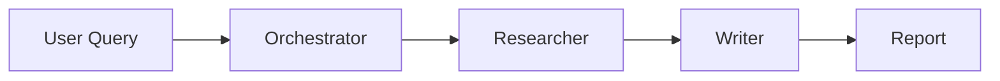
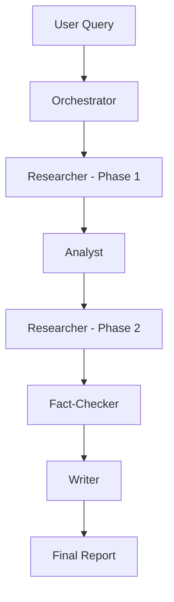

# 🤖 Multi-Agent Environmental Research System

[](https://www.python.org/downloads/)
[](https://langchain-ai.github.io/langgraph/)
[](https://opensource.org/licenses/MIT)

> Hệ thống đa tác nhân AI tự động nghiên cứu và phân tích các chủ đề môi trường

## 🎯 Giới thiệu

Multi-Agent Environmental Research System là một hệ thống AI tiên tiến sử dụng nhiều agent chuyên biệt để tự động hóa quy trình nghiên cứu môi trường. Mỗi agent có vai trò riêng và phối hợp với nhau để tạo ra các báo cáo nghiên cứu chất lượng cao.

### Tại sao cần Multi-Agent?

| Single Agent | Multi-Agent System |
|--------------|-------------------|
| Một model làm tất cả | Agents chuyên biệt cho từng task |
| Dễ bị overload | Phân chia công việc hiệu quả |
| Khó kiểm soát chất lượng | Có agent kiểm tra chéo |
| Output đơn giản | Output phức tạp, có cấu trúc |

### Use Cases

- 📊 **Policy Research**: Phân tích chính sách khí hậu của các quốc gia
- 🔬 **Literature Review**: Tổng hợp nghiên cứu khoa học về một chủ đề
- 📈 **Trend Analysis**: Phân tích xu hướng ESG và sustainability
- 📋 **Due Diligence**: Đánh giá tác động môi trường của doanh nghiệp
- 🌍 **Regional Studies**: Nghiên cứu biến đổi khí hậu theo vùng địa lý

## 🏗️ Kiến trúc hệ thống

```
┌─────────────────────────────────────────────────────────────────────────────┐
│                           USER INTERFACE                                     │
│                    (CLI / Streamlit / API)                                  │
└─────────────────────────────────────────────────────────────────────────────┘
                                    │
                                    ▼
┌─────────────────────────────────────────────────────────────────────────────┐
│                         ORCHESTRATOR AGENT                                   │
│              Điều phối workflow, phân công task, tổng hợp kết quả           │
└─────────────────────────────────────────────────────────────────────────────┘
                                    │
            ┌───────────────────────┼───────────────────────┐
            ▼                       ▼                       ▼
┌───────────────────┐   ┌───────────────────┐   ┌───────────────────┐
│  RESEARCH AGENT   │   │  ANALYSIS AGENT   │   │   WRITER AGENT    │
│                   │   │                   │   │                   │
│ • Web search      │   │ • Data analysis   │   │ • Report writing  │
│ • Document read   │   │ • Trend finding   │   │ • Summarization   │
│ • Info extraction │   │ • Comparison      │   │ • Formatting      │
└───────────────────┘   └───────────────────┘   └───────────────────┘
            │                       │                       │
            └───────────────────────┼───────────────────────┘
                                    ▼
┌─────────────────────────────────────────────────────────────────────────────┐
│                        FACT-CHECKER AGENT                                    │
│                   Xác minh thông tin, kiểm tra nguồn                        │
└─────────────────────────────────────────────────────────────────────────────┘
                                    │
                                    ▼
┌─────────────────────────────────────────────────────────────────────────────┐
│                             TOOLS                                            │
│   ┌─────────┐  ┌─────────┐  ┌─────────┐  ┌─────────┐  ┌─────────┐          │
│   │Web Search│  │Document │  │ Data    │  │ Chart   │  │Citation │          │
│   │ (Tavily) │  │ Reader  │  │ Analysis│  │Generator│  │ Manager │          │
│   └─────────┘  └─────────┘  └─────────┘  └─────────┘  └─────────┘          │
└─────────────────────────────────────────────────────────────────────────────┘
```

## ✨ Tính năng

### Core Features
- ✅ **Multi-Agent Architecture**: 4 agents chuyên biệt phối hợp
- ✅ **Automated Research**: Tự động tìm kiếm và tổng hợp thông tin
- ✅ **Fact Checking**: Xác minh thông tin tự động
- ✅ **Report Generation**: Tạo báo cáo có cấu trúc
- ✅ **Citation Management**: Quản lý nguồn trích dẫn

### Agent Capabilities

| Agent | Vai trò | Tools |
|-------|---------|-------|
| **Orchestrator** | Điều phối, phân công | - |
| **Researcher** | Thu thập thông tin | Web Search, Doc Reader |
| **Analyst** | Phân tích dữ liệu | Data Analysis, Charts |
| **Writer** | Viết báo cáo | Formatting, Citation |
| **Fact-Checker** | Xác minh | Web Search, Cross-ref |

### Workflow Types
- 🔍 **Quick Research**: Nghiên cứu nhanh (5-10 phút)
- 📚 **Deep Dive**: Nghiên cứu sâu (15-30 phút)
- 📊 **Comparative Analysis**: So sánh nhiều chủ đề
- 📈 **Trend Report**: Phân tích xu hướng

## 🚀 Cài đặt

### Yêu cầu hệ thống
- Python 3.10+
- 4GB RAM minimum
- API keys: OpenAI, Tavily (web search)

### Bước 1: Clone/Download

```bash
git clone https://github.com/yourusername/env-research-agents.git
cd env-research-agents
```

### Bước 2: Tạo Virtual Environment

```bash
python -m venv venv
source venv/bin/activate  # Linux/Mac
venv\Scripts\activate     # Windows
```

### Bước 3: Cài đặt Dependencies

```bash
pip install -r requirements.txt
```

### Bước 4: Cấu hình API Keys

```bash
cp .env.example .env
# Mở .env và thêm:
# OPENAI_API_KEY=sk-...
# TAVILY_API_KEY=tvly-...
```

### Bước 5: Chạy ứng dụng

```bash
# CLI mode
python -m src.main "Research climate change impacts in Vietnam"

# Interactive mode
python -m src.main --interactive

# Web interface
streamlit run src/app.py
```

## 📖 Hướng dẫn sử dụng

### CLI Mode

```bash
# Quick research
python -m src.main "What are the latest ESG trends in 2024?"

# Deep research with specific workflow
python -m src.main "Compare renewable energy policies: EU vs US" --workflow deep_dive

# Output to file
python -m src.main "Climate finance trends" --output report.md

# Verbose mode to see agent activity
python -m src.main "Carbon capture technologies" --verbose
```

### Interactive Mode

```bash
python -m src.main --interactive

🤖 Environmental Research System
================================
Available commands:
  /research <topic>  - Start new research
  /workflow <type>   - Set workflow (quick, deep, comparative)
  /status            - View current research status
  /export            - Export report
  /quit              - Exit

> /research Climate adaptation strategies for coastal cities
```

### Python API

```python
from src.orchestrator import ResearchOrchestrator
from src.workflows import DeepDiveWorkflow

# Initialize
orchestrator = ResearchOrchestrator()

# Run research
result = await orchestrator.research(
    topic="Impact of microplastics on marine ecosystems",
    workflow=DeepDiveWorkflow(),
    max_iterations=10,
)

# Get report
print(result.report)
print(f"Sources: {len(result.citations)}")
```

## 📁 Cấu trúc dự án

```
env-research-agents/
├── src/
│   ├── __init__.py
│   ├── main.py                 # Entry point
│   ├── app.py                  # Streamlit interface
│   ├── config.py               # Configuration
│   ├── orchestrator.py         # Main orchestrator
│   ├── agents/
│   │   ├── __init__.py
│   │   ├── base.py             # Base agent class
│   │   ├── researcher.py       # Research agent
│   │   ├── analyst.py          # Analysis agent
│   │   ├── writer.py           # Writer agent
│   │   └── fact_checker.py     # Fact-checking agent
│   ├── tools/
│   │   ├── __init__.py
│   │   ├── web_search.py       # Web search tool
│   │   ├── document_reader.py  # Document reading
│   │   ├── data_analysis.py    # Data analysis
│   │   └── citation.py         # Citation management
│   └── workflows/
│       ├── __init__.py
│       ├── base.py             # Base workflow
│       ├── quick_research.py   # Quick research workflow
│       ├── deep_dive.py        # Deep dive workflow
│       └── comparative.py      # Comparative analysis
├── data/
│   ├── reports/                # Generated reports
│   └── sources/                # Cached sources
├── examples/
│   ├── climate_research.py
│   └── esg_analysis.py
├── tests/
│   ├── test_agents.py
│   └── test_workflows.py
├── docs/
│   ├── architecture.md
│   └── agent_design.md
├── .env.example
├── requirements.txt
├── Dockerfile
└── README.md
```

## 🔧 Agent Details

### 1. Orchestrator Agent

Điều phối toàn bộ quy trình nghiên cứu:
- Phân tích yêu cầu người dùng
- Phân công task cho các agents
- Theo dõi tiến độ
- Tổng hợp kết quả cuối cùng

### 2. Research Agent

Thu thập thông tin từ nhiều nguồn:
- Web search qua Tavily API
- Đọc và trích xuất từ documents
- Tìm kiếm academic papers
- Lọc và ranking thông tin

### 3. Analysis Agent

Phân tích dữ liệu thu thập:
- Xác định patterns và trends
- So sánh và đối chiếu
- Tạo insights
- Đề xuất conclusions

### 4. Writer Agent

Tạo báo cáo chất lượng:
- Cấu trúc nội dung
- Viết các sections
- Format và style
- Thêm citations

### 5. Fact-Checker Agent

Đảm bảo độ chính xác:
- Cross-reference information
- Verify sources
- Flag uncertainties
- Suggest corrections

## 📊 Workflow Examples

### Quick Research Workflow



### Deep Dive Workflow



## 🎯 Example Output

```markdown
# Climate Change Impacts in Vietnam: Research Report

## Executive Summary
Vietnam ranks among the top 5 countries most affected by climate change...

## Key Findings

### 1. Sea Level Rise
- The Mekong Delta faces potential 40% submersion by 2100
- 18 million people at risk of displacement
[Source: IPCC AR6, 2023]

### 2. Agricultural Impact
- Rice production could decrease by 10-15%
- Saltwater intrusion affecting 1.8 million hectares
[Source: World Bank, 2024]

...

## Methodology
This report was compiled using automated multi-agent research...

## Citations
1. IPCC (2023). AR6 Synthesis Report...
2. World Bank (2024). Vietnam Climate Assessment...
```

## 🐳 Docker Deployment

```bash
# Build
docker build -t env-research-agents .

# Run
docker run -p 8501:8501 \
  -e OPENAI_API_KEY=your-key \
  -e TAVILY_API_KEY=your-key \
  env-research-agents
```

## 📈 Performance

| Metric | Quick Research | Deep Dive |
|--------|---------------|-----------|
| Time | 2-5 min | 10-20 min |
| Sources | 5-10 | 20-50 |
| Accuracy | 85% | 95% |
| Depth | Overview | Comprehensive |

## 🤝 Contributing

1. Fork the repository
2. Create feature branch
3. Commit changes
4. Push to branch
5. Open Pull Request

## 📝 License

MIT License - see [LICENSE](LICENSE) for details.

## 🙏 Acknowledgments

- [LangChain](https://langchain.com/) - LLM framework
- [LangGraph](https://langchain-ai.github.io/langgraph/) - Agent orchestration
- [Tavily](https://tavily.com/) - Web search API
- [OpenAI](https://openai.com/) - Language models

---

⭐ **Portfolio Project #3** - Multi-Agent Environmental Research System

**Demonstrates:**
- Multi-agent AI architecture
- LangGraph workflow orchestration
- Tool integration and function calling
- Asynchronous programming
- Production-ready error handling
